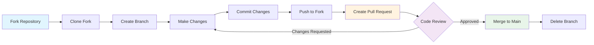
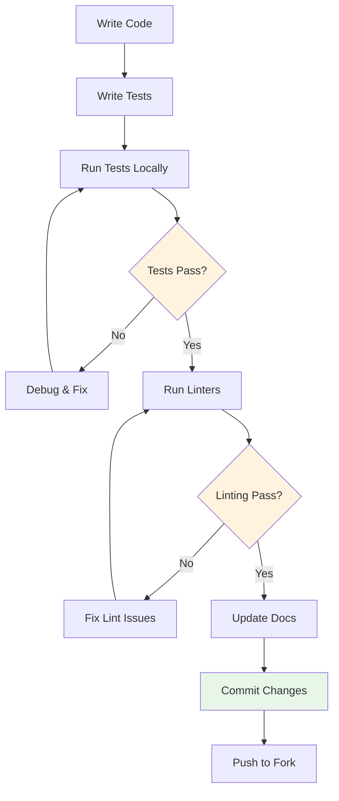

# Contributing to FLYFOX AI Platform


Thank you for your interest in contributing to the FLYFOX AI Platform powered by the NQBA (Neuromorphic Quantum Business Architecture) Stack! This document provides guidelines and information for contributors.

## Table of Contents

- [Code of Conduct](#code-of-conduct)
- [Getting Started](#getting-started)
- [Development Setup](#development-setup)
- [Contribution Process](#contribution-process)
- [Code Standards](#code-standards)
- [Testing](#testing)
- [Documentation](#documentation)
- [Licensing](#licensing)

## Code of Conduct

This project adheres to our [Code of Conduct](CODE_OF_CONDUCT.md). By participating, you are expected to uphold this code.

## Getting Started

### Prerequisites

- Python 3.9+
- Git
- Docker (for containerized development)
- Node.js 18+ (for frontend components)

### Quick Start

1. **Fork the repository**
   ```bash
   git clone https://github.com/your-username/flyfox-platform.git
   cd flyfox-platform
   ```

2. **Set up development environment**
   ```bash
   python -m venv flyfox-env
   source flyfox-env/bin/activate  # On Windows: flyfox-env\Scripts\activate
   pip install -r requirements.txt
   pip install -r requirements-dev.txt
   ```

3. **Run tests to verify setup**
   ```bash
   pytest tests/
   ```

## Development Setup

### Environment Configuration

1. **Copy environment template**
   ```bash
   cp .env.example .env
   ```

2. **Configure environment variables**
   ```bash
   # Required for development
   NQBA_ENV=development
   NQBA_DEBUG=true
   NQBA_SECRET_KEY=your-secret-key-here
   
   # Optional: Quantum integration
   DYNEX_API_KEY=your-dynex-key
   DYNEX_ENDPOINT=https://dynex.ai/api
   ```

3. **Database setup**
   ```bash
   # For development, SQLite is used by default
   # For production, configure PostgreSQL/MySQL
   ```

### IDE Configuration

#### VS Code
- Install Python extension
- Configure Python interpreter to use virtual environment
- Install recommended extensions from `.vscode/extensions.json`

#### PyCharm
- Set project interpreter to virtual environment
- Enable type checking
- Configure code style to match project standards

## Contribution Process

### 1. Issue Creation

Before submitting code, please:

- **Search existing issues** to avoid duplicates
- **Use issue templates** for bug reports and feature requests
- **Provide clear descriptions** with reproduction steps
- **Include environment details** and error messages

**Issue Labels:**
- `bug`: Something isn't working correctly
- `enhancement`: New feature or improvement
- `documentation`: Documentation improvements
- `good first issue`: Good for newcomers
- `help wanted`: Extra attention is needed
- `security`: Security-related issues

### 2. Branch Strategy

We use a simplified Git flow:

```bash
# Create feature branch from main
git checkout main
git pull origin main
git checkout -b feature/your-feature-name

# For bug fixes
git checkout -b fix/issue-description

# For documentation
git checkout -b docs/description

# For security fixes
git checkout -b security/vulnerability-description
```

**Branch Naming Convention:**
- `feature/descriptive-name`: New features
- `fix/issue-number-description`: Bug fixes
- `docs/what-changed`: Documentation updates
- `refactor/what-refactored`: Code refactoring
- `test/what-tested`: Test additions/improvements
- `security/vulnerability-fix`: Security patches

### 3. Git Workflow Diagram



### 4. Development Workflow

Follow this workflow for all contributions:

1. **Make changes** following code standards
   - Write clean, readable code
   - Follow existing patterns in the codebase
   - Keep changes focused and minimal
   
2. **Write/update tests** for new functionality
   - Maintain or improve code coverage
   - Test edge cases and error conditions
   - Ensure tests are deterministic and isolated
   
3. **Update documentation** as needed
   - Update docstrings for modified functions
   - Add examples for new features
   - Update relevant markdown documentation
   
4. **Run tests locally** before committing
   - Run full test suite: `pytest`
   - Check code coverage: `pytest --cov=src/`
   - Fix any failing tests
   
5. **Commit with clear messages**
   - Use conventional commit format
   - Reference related issues
   - Keep commits atomic and focused

**Development Cycle:**



### 4. Commit Message Format

Use conventional commit format:

```
type(scope): description

[optional body]

[optional footer]
```

Examples:
```
feat(auth): add multi-factor authentication support
fix(api): resolve rate limiting edge case
docs(readme): update installation instructions
test(quantum): add benchmark tests for QUBO solver
```

### 5. Pull Request Process

1. **Create PR** with clear description
2. **Link related issues** using keywords
3. **Request reviews** from maintainers
4. **Address feedback** and make requested changes
5. **Maintainers merge** after approval

## Code Standards

### Python Standards

- **Style**: Follow PEP 8 with Black formatting
- **Type hints**: Use type annotations for all functions
- **Docstrings**: Use Google-style docstrings
- **Imports**: Group imports (standard library, third-party, local)

### Code Quality Tools

```bash
# Format code
black src/ tests/

# Lint code
flake8 src/ tests/

# Type checking
mypy src/

# Security scanning
bandit -r src/

# Run all quality checks
pre-commit run --all-files
```

### Pre-commit Hooks

We use pre-commit hooks for code quality:

```bash
# Install pre-commit
pip install pre-commit

# Install hooks
pre-commit install

# Run manually
pre-commit run --all-files
```

## Testing

### Test Structure

```
tests/
├── unit/           # Unit tests
├── integration/    # Integration tests
├── e2e/           # End-to-end tests
├── benchmarks/    # Performance tests
└── fixtures/      # Test data and mocks
```

### Running Tests

```bash
# Run all tests
pytest

# Run specific test file
pytest tests/test_auth_system.py

# Run with coverage
pytest --cov=src/ --cov-report=html

# Run performance tests
pytest tests/benchmarks/ -m "not slow"

# Run tests in parallel
pytest -n auto
```

### Writing Tests

Follow these best practices for writing tests:

- **Test naming**: `test_<function_name>_<scenario>`
  - Example: `test_orchestrator_handles_invalid_pod_id`
  - Example: `test_quantum_adapter_with_timeout`
  
- **Arrange-Act-Assert**: Structure tests clearly
  ```python
  def test_calculate_sum():
      # Arrange
      numbers = [1, 2, 3, 4, 5]
      
      # Act
      result = calculate_sum(numbers)
      
      # Assert
      assert result == 15
  ```

- **Mock external dependencies**: Use pytest-mock
  ```python
  def test_api_call_with_mock(mocker):
      # Mock external API call
      mock_response = mocker.patch('requests.get')
      mock_response.return_value.json.return_value = {'status': 'ok'}
      
      # Test function that calls API
      result = fetch_data()
      assert result['status'] == 'ok'
  ```

- **Test edge cases**: Include error conditions
  ```python
  def test_division_by_zero():
      with pytest.raises(ZeroDivisionError):
          divide(10, 0)
  ```

- **Use fixtures**: Share common test setup
  ```python
  @pytest.fixture
  def sample_orchestrator():
      """Provides a configured orchestrator instance for tests"""
      return NQBAStackOrchestrator(config=test_config)
      
  def test_orchestrator_task_routing(sample_orchestrator):
      # Use the fixture
      result = sample_orchestrator.route_task(task)
      assert result.success
  ```

- **Parametrize tests**: Test multiple scenarios efficiently
  ```python
  @pytest.mark.parametrize("input,expected", [
      (2, 4),
      (3, 9),
      (4, 16),
  ])
  def test_square(input, expected):
      assert square(input) == expected
  ```

## Documentation

### Documentation Standards

- **Clear and concise** writing
- **Code examples** for all APIs
- **Diagrams** for complex concepts
- **Regular updates** with code changes

### Documentation Structure

```
docs/
├── api/           # API documentation
├── architecture/  # System architecture
├── deployment/    # Deployment guides
├── development/   # Developer guides
├── user/          # User guides
└── examples/      # Code examples
```

### Updating Documentation

- **Update docs** when changing APIs
- **Include examples** for new features
- **Review accuracy** of existing content
- **Use consistent formatting**

## Licensing

### License Types

- **Core SDKs & Examples**: Apache License 2.0
- **Server Components**: Business Source License 1.1
- **Documentation**: Creative Commons BY 4.0
- **Brand Assets**: All Rights Reserved

### Contributor License Agreement

By contributing to this project, you agree that:

1. **Your contributions** are your original work
2. **You have the right** to grant the licenses
3. **You understand** the license terms
4. **You grant licenses** as specified in the project license

### Copyright Assignment

- **Individual contributors** retain copyright
- **Corporate contributors** should specify employer
- **License grants** are non-exclusive and perpetual
- **Attribution** is maintained in source code

## Getting Help

### Communication Channels

- **GitHub Issues**: For bugs and feature requests
- **GitHub Discussions**: For questions and ideas
- **Discord**: For real-time chat (invite link in README)
- **Email**: dev@flyfox.ai for private matters

### Resources

- **API Documentation**: `/docs` endpoint when running locally
- **Architecture Guide**: `docs/architecture/`
- **Development Guide**: `docs/development/`
- **Contributor FAQ**: `docs/contributing/faq.md`

## Recognition

### Contributors

- **Code contributors** are listed in GitHub contributors
- **Documentation contributors** are acknowledged in docs
- **Bug reporters** are credited in release notes
- **Security researchers** are recognized in security policy

### Hall of Fame

- **Top contributors** get special recognition
- **Long-term contributors** receive maintainer status
- **Security researchers** are added to security hall of fame
- **Community leaders** get ambassador status

---

**Thank you for contributing to NQBA Stack!**

Your contributions help build the operating system of the intelligence economy. Together, we're creating the future of quantum-powered business automation.

For questions about contributing, please open an issue or contact us at dev@flyfox.ai.
