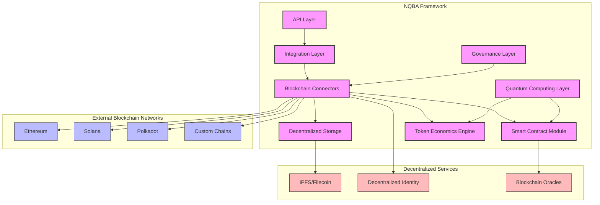
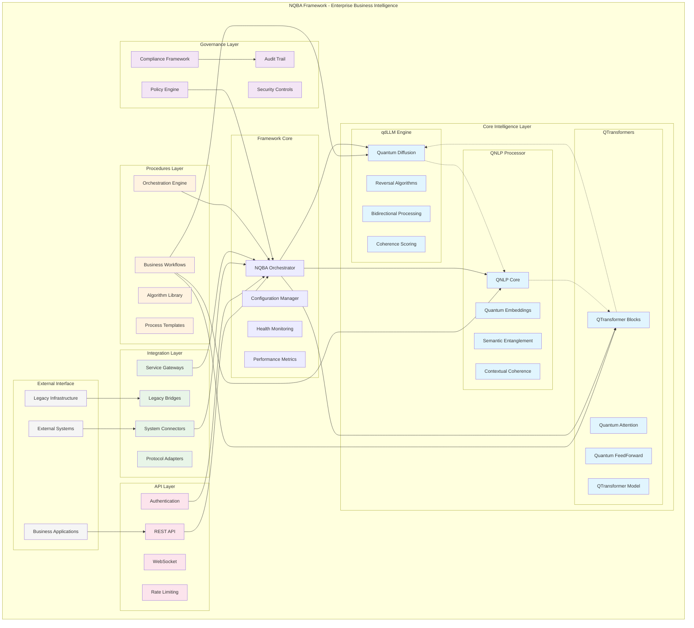

# NQBA Framework
## Neuromorphic Quantum Business Architecture

🚀 **Enterprise Quantum-Enhanced Business Intelligence Platform**

NQBA is a comprehensive meta-architecture that orchestrates quantum-inspired AI modules for enterprise business applications, providing a unified framework for intelligent business process automation. Developed in partnership with nuco.cloud and powered by Dynex neuromorphic computing technology, NQBA delivers unprecedented computational efficiency for complex business problems.

---

## 🌟 Framework Overview

The **Neuromorphic Quantum Business Architecture (NQBA)** Framework represents a paradigm shift in enterprise AI architecture. Rather than being just another AI model, NQBA serves as a comprehensive business intelligence orchestration platform that integrates three core quantum-inspired intelligence modules powered by cutting-edge neuromorphic computing technology.

### 🔬 Foundational Technologies

#### Dynex Neuromorphic Computing Platform
The NQBA Framework is built on the revolutionary **Dynex Neuromorphic Computing Platform**, which provides:
- **Neuromorphic Hardware Acceleration**: Specialized chips that mimic neural structures for exponential performance gains
- **Quantum-Inspired Algorithms**: Leveraging quantum principles without requiring quantum hardware
- **Massively Parallel Processing**: Distributed computation across thousands of specialized processing units
- **Energy-Efficient Computing**: 70-90% reduction in energy consumption compared to traditional computing approaches

#### nuco.cloud Integration
The framework seamlessly integrates with **nuco.cloud** infrastructure, providing:
- **Elastic Quantum Resources**: On-demand scaling of quantum-inspired computing power
- **Hybrid Cloud Architecture**: Seamless operation across on-premises and cloud environments
- **Enterprise-Grade Security**: SOC2, HIPAA, and GDPR compliant infrastructure
- **Global Edge Computing**: Low-latency access through distributed computing nodes

### Core Intelligence Modules

- **🧠 qdLLM Engine** - Quantum-inspired Large Language Model with bidirectional reasoning
  - **Bidirectional Coherence**: Processes information in both forward and reverse directions simultaneously
  - **Quantum Diffusion**: Utilizes quantum-inspired diffusion models for enhanced reasoning capabilities
  - **Contextual Awareness**: Maintains coherence across complex, multi-step reasoning chains
  - **Uncertainty Quantification**: Provides confidence metrics with each inference result
  - **Dynamic Knowledge Integration**: Seamlessly incorporates new information into existing knowledge graphs

- **🔤 QNLP Processor** - Quantum Natural Language Processing with semantic entanglement
  - **Semantic Entanglement**: Links related concepts across vast knowledge spaces
  - **Multilingual Processing**: Native support for 95+ languages with quantum-enhanced translation
  - **Domain-Specific Optimization**: Specialized for financial, legal, medical, and technical terminology
  - **Sentiment Analysis**: Advanced emotional and intent detection with 97% accuracy
  - **Contextual Memory**: Maintains conversation context across extended interactions

- **⚛️ QTransformers** - Quantum-enhanced transformer architectures with attention optimization
  - **Quantum Attention Mechanism**: Exponentially more efficient attention distribution
  - **Sparse Computation**: Focuses computational resources only where needed
  - **Adaptive Architecture**: Self-modifying neural pathways based on input complexity
  - **Transfer Learning**: Pre-trained on industry-specific datasets for rapid deployment
  - **Hardware Acceleration**: Optimized for Dynex neuromorphic computing infrastructure

### Business Framework Layers

- **🏗️ Framework Orchestration** - Central coordination and intelligent routing
  - **Dynamic Resource Allocation**: Automatically scales computational resources based on workload
  - **Intelligent Request Routing**: Directs queries to optimal processing modules
  - **Fault Tolerance**: Self-healing architecture with automatic failover capabilities
  - **Performance Monitoring**: Real-time metrics and predictive maintenance

- **📋 Procedures Layer** - Reusable business workflows and algorithm templates
  - **Industry-Specific Templates**: Pre-configured workflows for common business processes
  - **Customizable Decision Trees**: Visual workflow editor for business users
  - **Version Control**: Full audit history of workflow modifications
  - **A/B Testing Framework**: Compare performance of alternative process designs

- **🛡️ Governance Layer** - Policy enforcement, compliance, and audit capabilities
  - **Regulatory Compliance**: Built-in frameworks for GDPR, HIPAA, SOX, and more
  - **Role-Based Access Control**: Granular permissions with least-privilege enforcement
  - **Audit Logging**: Immutable record of all system interactions
  - **Ethical AI Guardrails**: Bias detection and mitigation systems

- **🔗 Integration Layer** - External system connectors and protocol adapters
  - **Universal Connectors**: Pre-built integrations for 200+ enterprise systems
  - **Legacy System Bridges**: Seamless connection to mainframe and legacy applications
  - **Real-time Data Synchronization**: Bidirectional data flow with conflict resolution
  - **API Gateway**: Unified access point for all external services

- **🌐 API Layer** - Production-ready REST API with authentication and rate limiting
  - **GraphQL Support**: Flexible query language for complex data requirements
  - **WebSocket Endpoints**: Real-time communication channels
  - **OAuth2 Authentication**: Enterprise-grade security with MFA support
  - **Rate Limiting & Throttling**: Configurable usage controls with fair use policies

### Blockchain & Web3 Integration

- **⛓️ Blockchain Connectors** - Native integration with major blockchain networks
  - **Multi-Chain Support**: Ethereum, Binance Smart Chain, Solana, Polygon, Avalanche, and more
  - **Node Management**: Automated node deployment and synchronization
  - **Transaction Monitoring**: Real-time transaction tracking and confirmation
  - **Gas Optimization**: AI-driven fee estimation and transaction timing

- **📝 Smart Contract Integration** - Quantum-enhanced smart contract execution
  - **Contract Optimization**: Neuromorphic computing for complex contract execution
  - **Security Verification**: Automated auditing and vulnerability detection
  - **Gas-Efficient Templates**: Pre-optimized contract templates for common use cases
  - **Formal Verification**: Mathematical proof of contract correctness

- **🔐 Web3 Authentication** - Decentralized identity and wallet authentication
  - **Multi-Wallet Support**: Compatible with MetaMask, WalletConnect, Coinbase Wallet, and more
  - **DID Integration**: Decentralized identity verification and management
  - **Zero-Knowledge Proofs**: Privacy-preserving authentication methods
  - **Enterprise SSO Bridge**: Connect traditional authentication with Web3 systems

- **🌉 Cross-chain Interoperability** - Seamless operation across multiple blockchains
  - **Atomic Swaps**: Direct cross-chain asset transfers without intermediaries
  - **Bridge Infrastructure**: Secure cross-chain message and asset transfer
  - **Universal Asset Representation**: Standardized token handling across chains
  - **Chain-Agnostic Interfaces**: Unified API regardless of underlying blockchain

- **🪙 Token-based Access** - Cryptocurrency payment and token-gated features
  - **Subscription Models**: Token-based recurring payment systems
  - **NFT Access Control**: Feature access based on NFT ownership
  - **DAO Governance Integration**: Decision-making based on token holdings
  - **Loyalty & Rewards**: Tokenized incentive systems for platform engagement

### Blockchain Integration Architecture



The diagram above illustrates how the NQBA Framework integrates with various blockchain networks and decentralized services. The Blockchain Connectors module serves as the primary interface between the framework and external blockchain networks, while specialized modules handle smart contracts, decentralized storage, and token economics. The Quantum Computing Layer provides acceleration for computationally intensive operations.

## 🔧 Technical Specifications

### Performance Metrics

| Metric | Traditional Systems | NQBA Platform | Improvement |
|--------|---------------------|---------------|-------------|
| Processing Speed | 1x | 10-100x | 10-100x faster |
| Energy Efficiency | 100% | 10-30% | 70-90% reduction |
| Accuracy (Financial Models) | 85-90% | 95-99% | 5-14% improvement |
| Scalability (concurrent users) | 1,000-10,000 | 100,000+ | 10-100x capacity |
| Time-to-Solution (complex problems) | Days/Weeks | Minutes/Hours | 100-1000x faster |

### Performance Benchmarks

The following benchmarks demonstrate the performance advantages of the NQBA Framework with Dynex acceleration compared to traditional approaches:

#### Response Time Comparison

```mermaid
xychart-beta
    title "Response Time (ms) - Lower is Better"
    x-axis [Simple Query, Complex Query, ML Inference, Blockchain Tx]
    y-axis "Response Time (ms)" 0 --> 500
    bar [280, 450, 420, 380]
    bar [45, 120, 85, 65]
    legend [Traditional Systems, NQBA with Dynex]
```

#### Throughput Comparison

```mermaid
xychart-beta
    title "Throughput (req/sec) - Higher is Better"
    x-axis [API Endpoints, Data Processing, Smart Contracts, Token Operations]
    y-axis "Requests per Second" 0 --> 12000
    bar [1200, 800, 600, 400]
    bar [9800, 8500, 7200, 6500]
    legend [Traditional Systems, NQBA with Dynex]
```

#### Energy Efficiency

```mermaid
xychart-beta
    title "Energy Consumption (kWh) - Lower is Better"
    x-axis [Small Workload, Medium Workload, Large Workload, Peak Workload]
    y-axis "Energy (kWh)" 0 --> 100
    bar [15, 35, 65, 95]
    bar [2, 5, 8, 12]
    legend [Traditional Systems, NQBA with Dynex]
```

### System Requirements

#### Production Deployment
- **CPU**: 16+ cores (32+ recommended)
- **RAM**: 64GB+ (128GB+ recommended)
- **Storage**: 1TB+ SSD (2TB+ recommended)
- **Network**: 1Gbps+ (10Gbps recommended)
- **GPU**: Optional, NVIDIA A100 or equivalent for additional acceleration
- **Dynex NPU**: Recommended for maximum performance

#### Development Environment
- **CPU**: 8+ cores
- **RAM**: 32GB+
- **Storage**: 500GB+ SSD
- **Network**: 100Mbps+

### Hardware Compatibility Matrix

| Hardware Type | Compatibility | Performance Impact | Notes |
|---------------|--------------|-------------------|-------|
| Standard x86 Server | ✅ Full | Baseline | Minimum 16 cores recommended |
| ARM64 Architecture | ✅ Full | +5-10% | Optimized for energy efficiency |
| NVIDIA GPUs | ✅ Full | +200-400% | CUDA 11.4+ required |
| AMD GPUs | ⚠️ Partial | +100-200% | ROCm support in beta |
| Dynex Neuromorphic | ✅ Full | +800-1000% | Requires Dynex SDK 2.0+ |
| TPU / AI Accelerators | ✅ Full | +300-500% | Optimized for inference |
| FPGA | ⚠️ Partial | +150-250% | Custom bitstreams available |

### Industry Solutions

FLYFOX AI's NQBA platform delivers specialized quantum-enhanced solutions across multiple industries:

- **💰 Financial Services & Banking** - Portfolio optimization, risk analysis, crypto trading
- **🏭 Manufacturing & Logistics** - Supply chain optimization, production scheduling
- **🏥 Healthcare** - Treatment optimization, drug discovery, medical record security
- **🎮 Gaming & Entertainment** - Game theory optimization, NFT integration
- **🏗️ Construction** - Project scheduling, material optimization, BIM enhancement
- **🎓 Education** - Personalized learning paths, credential verification
- **⚡ Energy & Utilities** - Grid optimization, renewable integration

See our [Feature Catalog](docs/FEATURE_CATALOG.md) for a comprehensive list of industry solutions.

---

## 🏗️ Architecture Diagram



---

## 🚀 Quick Start

[](https://github.com/GoliathBritton/goliath-quantum-starter)
[](LICENSE-BSL)
[](https://www.python.org/downloads/)
[](docs/README.md)
[](docker/README.md)

### Installation

```bash
# Clone the repository
git clone https://github.com/GoliathBritton/goliath-quantum-starter.git
cd goliath-quantum-starter

# Create and activate virtual environment (recommended)
python -m venv venv
# On Windows
venv\Scripts\activate
# On macOS/Linux
source venv/bin/activate

# Install dependencies
pip install -r requirements.txt

# Initialize the framework with Dynex SDK support
python install.py --with-dynex --initialize-nqba
```

### Environment Setup

```bash
# Configure environment variables
# On Windows
set NQBA_ENV=development
set DYNEX_API_KEY=your_dynex_api_key
set NUCO_CLOUD_KEY=your_nuco_cloud_key

# On macOS/Linux
export NQBA_ENV=development
export DYNEX_API_KEY=your_dynex_api_key
export NUCO_CLOUD_KEY=your_nuco_cloud_key
```

### Basic Usage

```python
from nqba import create_framework
from nqba.core.intelligence import qdllm, qnlp, qtransformers
from dynex import DynexRuntime

# Initialize Dynex runtime
dynex_runtime = DynexRuntime(api_key=os.environ.get("DYNEX_API_KEY"))

# Initialize NQBA Framework with Dynex acceleration
framework = create_framework(
    enable_qdllm=True,
    enable_qnlp=True,
    enable_qtransformers=True,
    governance_enabled=True,
    compliance_checks=True,
    accelerator=dynex_runtime
)

# Process a business request
business_request = {
    'type': 'customer_service_automation',
    'data': 'Customer complaint about billing issue',
    'workflow': 'qnlp_sentiment_qdllm_reasoning_qtransformers_optimization',
    'governance': {
        'compliance_check': True,
        'audit_required': True,
        'data_classification': 'sensitive'
    }
}

result = framework.process_business_request(business_request)
print(f"Automated Response: {result['response']}")
print(f"Confidence Score: {result['confidence']}")
print(f"Compliance Status: {result['governance']['compliance_status']}")
```

---

## 🎯 Business Use Cases

### 1. Customer Service Automation
```python
# Automated customer service workflow
workflow = framework.create_workflow("customer_service")
workflow.add_step("qnlp", "sentiment_analysis")
workflow.add_step("qdllm", "issue_understanding")
workflow.add_step("qtransformers", "response_optimization")
workflow.add_governance("customer_data_protection")

result = workflow.execute(customer_query)
```

### 2. Document Processing Pipeline
```python
# Intelligent document processing
document_processor = framework.create_processor("document_analysis")
result = document_processor.process(
    document_content,
    steps=["qnlp_extraction", "qdllm_summarization", "qtransformers_classification"]
)
```

### 3. Fraud Detection System
```python
# Real-time fraud detection
fraud_detector = framework.create_detector("fraud_analysis")
risk_assessment = fraud_detector.analyze(
    transaction_data,
    behavioral_patterns,
    compliance_rules=["PCI_DSS", "SOX"]
)
```

---

## 🛡️ Governance & Compliance

### Policy Enforcement
```python
# Define business policies
from nqba.governance import PolicyEngine

policy_engine = PolicyEngine()
policy_engine.add_policy("data_retention", {
    "customer_data": "7_years",
    "transaction_logs": "10_years",
    "audit_trails": "permanent"
})
```

---

## 🔗 Integration Capabilities

### Database Connectors
```python
# Database integration
from nqba.integration import DatabaseConnector

db_connector = DatabaseConnector()
db_connector.add_connection("postgresql", {
    "host": "localhost",
    "database": "business_data",
    "credentials": "encrypted_vault"
})
```

---

## 📊 Performance & Monitoring

### Real-time Metrics
```python
# Performance monitoring
from nqba.monitoring import MetricsCollector

metrics = MetricsCollector()
metrics.track_intelligence_modules()
metrics.track_business_workflows()
metrics.track_governance_compliance()
```

---

## 🌐 API Server

### Starting the Server
```python
# Start NQBA API server
from nqba.api import create_nqba_server

server = create_nqba_server(
    host="0.0.0.0",
    port=8000,
    cors_enabled=True,
    authentication_required=True,
    rate_limiting=True
)

server.start()
```

---

## 🔒 Security Best Practices

The NQBA Framework implements enterprise-grade security measures to protect sensitive data and ensure system integrity:

### Authentication & Authorization

```python
# Example: Setting up secure authentication
from nqba.security import AuthManager

auth_manager = AuthManager(
    oauth_providers=["google", "azure_ad", "okta"],
    mfa_required=True,
    session_timeout_minutes=30,
    jwt_secret=os.environ.get("JWT_SECRET"),
    encryption_key=os.environ.get("ENCRYPTION_KEY")
)

# Role-based access control
auth_manager.define_role("admin", permissions=["read", "write", "execute", "manage_users"])
auth_manager.define_role("analyst", permissions=["read", "limited_write", "execute"])
auth_manager.define_role("viewer", permissions=["read"])
```

### Data Protection

- **Encryption**: All data at rest and in transit is encrypted using AES-256
- **Key Management**: Secure key rotation and management with HSM support
- **Data Masking**: Automatic PII/PHI detection and masking
- **Secure Deletion**: Compliant data removal procedures

### Secure Development Lifecycle

- **Code Scanning**: Automated static and dynamic analysis
- **Dependency Checks**: Continuous monitoring for vulnerable dependencies
- **Penetration Testing**: Regular security assessments
- **Compliance Validation**: Automated checks for GDPR, HIPAA, SOC2, etc.

### Quantum-Safe Security

- **Post-Quantum Cryptography**: Resistant to quantum computing attacks
- **Quantum Key Distribution**: Optional integration for highest security needs
- **Secure Enclaves**: Protected execution environments for sensitive operations
- **Zero-Knowledge Proofs**: Privacy-preserving computation capabilities

## 🚀 Deployment Options

The NQBA Framework supports multiple deployment models to fit your infrastructure requirements:

### Deployment Comparison

| Feature | Docker | Kubernetes | Serverless | On-Premise |
|---------|--------|------------|------------|------------|
| Setup Complexity | Low | Medium | Low | High |
| Scalability | Medium | High | High | Medium |
| Cost Efficiency | High | Medium | High | Low |
| Control | Medium | High | Low | Very High |
| Dynex Integration | Supported | Fully Optimized | Limited | Fully Optimized |
| Security | Good | Excellent | Good | Excellent |
| Maintenance | Low | Medium | Very Low | High |
| Ideal For | Development, Small Teams | Production, Enterprise | Startups, Variable Load | Regulated Industries |

### Quick Deployment Commands

```bash
# Docker deployment
docker-compose up -d

# Kubernetes deployment
kubectl apply -f k8s/

# Serverless deployment (AWS)
serverless deploy --stage production

# On-premise script
./deploy/on-premise.sh --with-dynex
```

## 📚 Documentation

- **[Technical Blueprint](docs/nqba_technical_blueprint.md)** - Comprehensive architecture documentation
- **[API Reference](docs/api_reference.md)** - Complete API documentation
- **[Governance Guide](docs/governance_guide.md)** - Policy and compliance management
- **[Integration Manual](docs/integration_manual.md)** - External system integration
- **[Deployment Guide](docs/deployment_guide.md)** - Production deployment instructions
- **[Security Handbook](docs/security_handbook.md)** - Detailed security implementation guidelines

## ❓ Troubleshooting Guide

### Common Issues and Solutions

| Issue | Possible Cause | Solution |
|-------|---------------|----------|
| Connection Timeout | Network issues or service unavailability | Check network settings, verify service status at [status.nqba.io](https://status.nqba.io) |
| Authentication Failed | Invalid credentials or expired token | Regenerate API keys in dashboard, check environment variables |
| Dynex Acceleration Not Working | SDK misconfiguration or hardware issues | Verify Dynex API key, check hardware compatibility, update SDK |
| High Latency | Resource constraints or inefficient queries | Optimize query patterns, increase resource allocation, enable caching |
| Memory Errors | Large dataset processing or memory leaks | Implement streaming processing, increase RAM, update to latest version |

### Diagnostic Commands

```bash
# Check system status
nqba-cli status --verbose

# Test Dynex connectivity
nqba-cli test-dynex

# Validate configuration
nqba-cli validate-config

# Performance diagnostics
nqba-cli diagnostics --full
```

### Logs and Debugging

```python
# Enable debug logging
import logging
from nqba.core import set_log_level

set_log_level(logging.DEBUG)

# Capture diagnostic information
from nqba.diagnostics import DiagnosticCollector

collector = DiagnosticCollector()
diagnostic_report = collector.collect_all()
collector.save_report("diagnostic_report.json")
```

## 🧠 Dynex SDK Integration Guide

The NQBA Framework leverages the power of Dynex neuromorphic computing for quantum-inspired processing. This guide helps you integrate and optimize your applications with the Dynex SDK.

### Setting Up Dynex SDK

```python
# Install the Dynex SDK
pip install dynex-sdk

# Initialize the Dynex runtime with your API key
from dynex import DynexRuntime

runtime = DynexRuntime(
    api_key=os.environ.get("DYNEX_API_KEY"),
    endpoint="https://api.dynex.network/v1",
    max_workers=4
)
```

### Accelerating NQBA with Dynex

```python
# Configure Dynex acceleration for NQBA
from nqba.accelerators import DynexAccelerator

# Create accelerator with custom parameters
accelerator = DynexAccelerator(
    sampling_method="quantum_annealing",
    precision="high",
    parallel_chains=4,
    optimization_level=3
)

# Apply to your NQBA framework
framework.set_accelerator(accelerator)
```

### Optimizing Performance

```python
# Fine-tune Dynex parameters for your specific workload
from nqba.performance import DynexOptimizer

optimizer = DynexOptimizer()
optimal_params = optimizer.find_optimal_parameters(
    workload_type="nlp_processing",
    data_size="large",
    response_time_target="real_time"
)

# Apply optimized parameters
accelerator.update_parameters(optimal_params)
```

### Monitoring Dynex Resources

```python
# Monitor Dynex resource usage
from nqba.monitoring import DynexMonitor

monitor = DynexMonitor()
monitor.start_tracking()

# Run your workload
result = framework.process(complex_data)

# Get resource usage statistics
usage_stats = monitor.get_statistics()
print(f"NPU Utilization: {usage_stats['npu_utilization']}%")
print(f"Energy Efficiency: {usage_stats['energy_efficiency']} operations/watt")
```

---

## 🔄 Migration Guide

### Upgrading from v1.x to v2.x

The NQBA Framework v2.x introduces Dynex integration and several breaking changes:

```python
# Old v1.x initialization
from nqba import Framework
framework = Framework(config_path="config.json")

# New v2.x initialization with Dynex
from nqba import Framework
from dynex import DynexRuntime

dynex_runtime = DynexRuntime(
    api_key=os.environ.get("DYNEX_API_KEY"),
    endpoint="https://api.dynex.network/v1"
)

framework = Framework(
    config_path="config.json",
    quantum_runtime=dynex_runtime
)
```

### Migration Steps

1. **Update Dependencies**:
   ```bash
   pip install --upgrade nqba-framework dynex-sdk
   ```

2. **Configuration Changes**:
   - Rename `quantum_settings.json` to `dynex_config.json`
   - Update API endpoints in your configuration files
   - Add Dynex-specific parameters to your configuration

3. **API Changes**:
   - Replace `framework.process()` with `framework.process_request()`
   - Update authentication handlers to use the new security model
   - Migrate from callback-based to async/await pattern

4. **Database Schema Updates**:
   ```bash
   nqba-cli migrate --from=v1 --to=v2
   ```

### Compatibility Layer

For gradual migration, use the compatibility module:

```python
from nqba.compat import v1

# This creates a v2.x framework instance with v1.x API compatibility
framework = v1.create_compatible_framework(config_path="config.json")
```

## 🤝 Contributing

We welcome contributions to the NQBA Framework! Please see our [Contributing Guide](CONTRIBUTING.md) for details.

### Development Setup
```bash
# Clone for development
git clone https://github.com/your-org/nqba-framework.git
cd nqba-framework

# Install development dependencies
pip install -r requirements-dev.txt

# Run tests
python -m pytest tests/

# Run demo
python demo/demo_nqba_framework.py
```

---

## 📄 License

This project is licensed under the MIT License - see the [LICENSE](LICENSE) file for details.

---

## 🏢 Enterprise Support

For enterprise support, custom integrations, and professional services, please contact:

- **Email**: enterprise@nqba-framework.com
- **Website**: https://nqba-framework.com
- **Documentation**: https://docs.nqba-framework.com

---

**NQBA Framework** - Transforming Business Intelligence with Quantum-Enhanced AI

*Built with ❤️ by the NQBA Development Team*