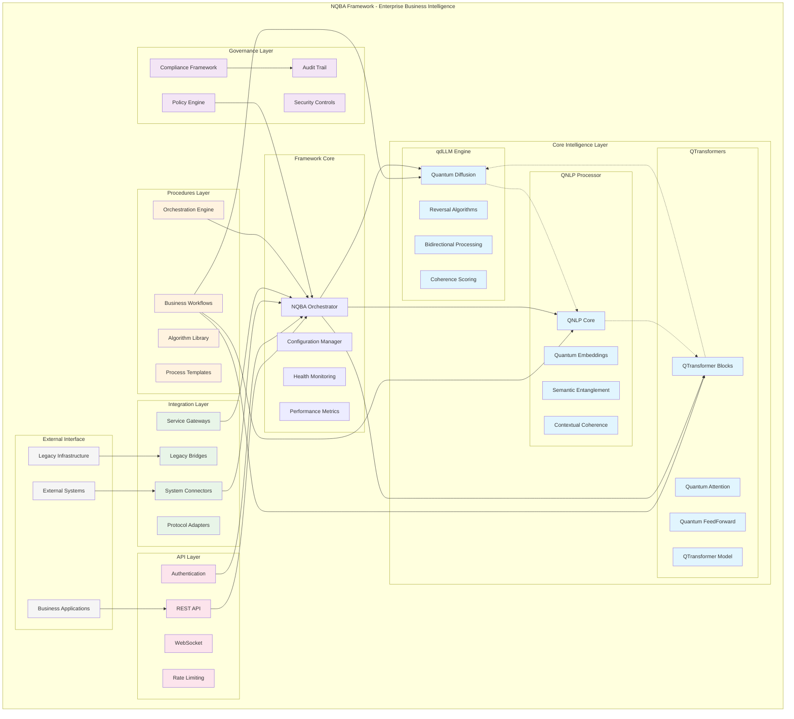

# NQBA Framework
## Neuromorphic Quantum Business Architecture

🚀 **Enterprise Quantum-Enhanced Business Intelligence Platform**

NQBA is a comprehensive meta-architecture that orchestrates quantum-inspired AI modules for enterprise business applications, providing a unified framework for intelligent business process automation.

---

## 🌟 Framework Overview

The **Neuromorphic Quantum Business Architecture (NQBA)** Framework represents a paradigm shift in enterprise AI architecture. Rather than being just another AI model, NQBA serves as a comprehensive business intelligence orchestration platform that integrates three core quantum-inspired intelligence modules:

### Core Intelligence Modules

- **🧠 qdLLM Engine** - Quantum-inspired Large Language Model with bidirectional reasoning
- **🔤 QNLP Processor** - Quantum Natural Language Processing with semantic entanglement
- **⚛️ QTransformers** - Quantum-enhanced transformer architectures with attention optimization

### Business Framework Layers

- **🏗️ Framework Orchestration** - Central coordination and intelligent routing
- **📋 Procedures Layer** - Reusable business workflows and algorithm templates
- **🛡️ Governance Layer** - Policy enforcement, compliance, and audit capabilities
- **🔗 Integration Layer** - External system connectors and protocol adapters
- **🌐 API Layer** - Production-ready REST API with authentication and rate limiting

---

## 🏗️ Architecture Diagram



---

## 🚀 Quick Start

### Installation

```bash
# Clone the repository
git clone https://github.com/your-org/nqba-framework.git
cd nqba-framework

# Install dependencies
pip install -r requirements.txt

# Initialize the framework
python -m nqba.setup --initialize
```

### Basic Usage

```python
from nqba import create_framework
from nqba.core.intelligence import qdllm, qnlp, qtransformers

# Initialize NQBA Framework
framework = create_framework(
    enable_qdllm=True,
    enable_qnlp=True,
    enable_qtransformers=True,
    governance_enabled=True,
    compliance_checks=True
)

# Process a business request
business_request = {
    'type': 'customer_service_automation',
    'data': 'Customer complaint about billing issue',
    'workflow': 'qnlp_sentiment_qdllm_reasoning_qtransformers_optimization',
    'governance': {
        'compliance_check': True,
        'audit_required': True,
        'data_classification': 'sensitive'
    }
}

result = framework.process_business_request(business_request)
print(f"Automated Response: {result['response']}")
print(f"Confidence Score: {result['confidence']}")
print(f"Compliance Status: {result['governance']['compliance_status']}")
```

---

## 🎯 Business Use Cases

### 1. Customer Service Automation
```python
# Automated customer service workflow
workflow = framework.create_workflow("customer_service")
workflow.add_step("qnlp", "sentiment_analysis")
workflow.add_step("qdllm", "issue_understanding")
workflow.add_step("qtransformers", "response_optimization")
workflow.add_governance("customer_data_protection")

result = workflow.execute(customer_query)
```

### 2. Document Processing Pipeline
```python
# Intelligent document processing
document_processor = framework.create_processor("document_analysis")
result = document_processor.process(
    document_content,
    steps=["qnlp_extraction", "qdllm_summarization", "qtransformers_classification"]
)
```

### 3. Fraud Detection System
```python
# Real-time fraud detection
fraud_detector = framework.create_detector("fraud_analysis")
risk_assessment = fraud_detector.analyze(
    transaction_data,
    behavioral_patterns,
    compliance_rules=["PCI_DSS", "SOX"]
)
```

---

## 🛡️ Governance & Compliance

### Policy Enforcement
```python
# Define business policies
from nqba.governance import PolicyEngine

policy_engine = PolicyEngine()
policy_engine.add_policy("data_retention", {
    "customer_data": "7_years",
    "transaction_logs": "10_years",
    "audit_trails": "permanent"
})
```

---

## 🔗 Integration Capabilities

### Database Connectors
```python
# Database integration
from nqba.integration import DatabaseConnector

db_connector = DatabaseConnector()
db_connector.add_connection("postgresql", {
    "host": "localhost",
    "database": "business_data",
    "credentials": "encrypted_vault"
})
```

---

## 📊 Performance & Monitoring

### Real-time Metrics
```python
# Performance monitoring
from nqba.monitoring import MetricsCollector

metrics = MetricsCollector()
metrics.track_intelligence_modules()
metrics.track_business_workflows()
metrics.track_governance_compliance()
```

---

## 🌐 API Server

### Starting the Server
```python
# Start NQBA API server
from nqba.api import create_nqba_server

server = create_nqba_server(
    host="0.0.0.0",
    port=8000,
    cors_enabled=True,
    authentication_required=True,
    rate_limiting=True
)

server.start()
```

---

## 📚 Documentation

- **[Technical Blueprint](docs/nqba_technical_blueprint.md)** - Comprehensive architecture documentation
- **[API Reference](docs/api_reference.md)** - Complete API documentation
- **[Governance Guide](docs/governance_guide.md)** - Policy and compliance management
- **[Integration Manual](docs/integration_manual.md)** - External system integration
- **[Deployment Guide](docs/deployment_guide.md)** - Production deployment instructions

---

## 🤝 Contributing

We welcome contributions to the NQBA Framework! Please see our [Contributing Guide](CONTRIBUTING.md) for details.

### Development Setup
```bash
# Clone for development
git clone https://github.com/your-org/nqba-framework.git
cd nqba-framework

# Install development dependencies
pip install -r requirements-dev.txt

# Run tests
python -m pytest tests/

# Run demo
python demo/demo_nqba_framework.py
```

---

## 📄 License

This project is licensed under the MIT License - see the [LICENSE](LICENSE) file for details.

---

## 🏢 Enterprise Support

For enterprise support, custom integrations, and professional services, please contact:

- **Email**: enterprise@nqba-framework.com
- **Website**: https://nqba-framework.com
- **Documentation**: https://docs.nqba-framework.com

---

**NQBA Framework** - Transforming Business Intelligence with Quantum-Enhanced AI

*Built with ❤️ by the NQBA Development Team*