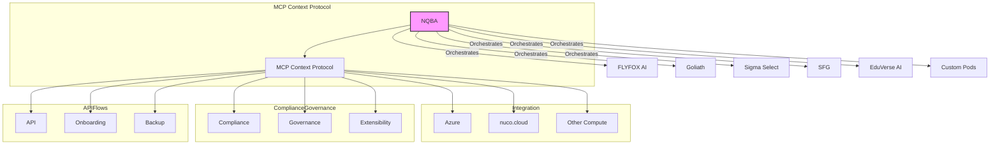

# Platform Architecture Dynamic Diagram

## Legend
- **NQBA**: The foundation and orchestrator of the platform.
- **Modular Business Pods**: Independent components that interact with the NQBA.
- **MCP Context Protocol**: The communication protocol for integration and orchestration.
- **Integrations**: Connects with external compute resources.
- **Compliance, Governance, Extensibility**: Frameworks ensuring the platform's reliability and adaptability.
- **API, Onboarding, Backup Flows**: Key operational flows for user interaction and data integrity.

## Workflow Description
This diagram represents a modular architecture where NQBA serves as the core orchestrator. Each business pod can operate independently yet seamlessly integrates into the overall system through the MCP context protocol. The architecture emphasizes quantum intent by ensuring real-time data processing and decision-making capabilities, enabling extensibility through additional pods and external integrations.