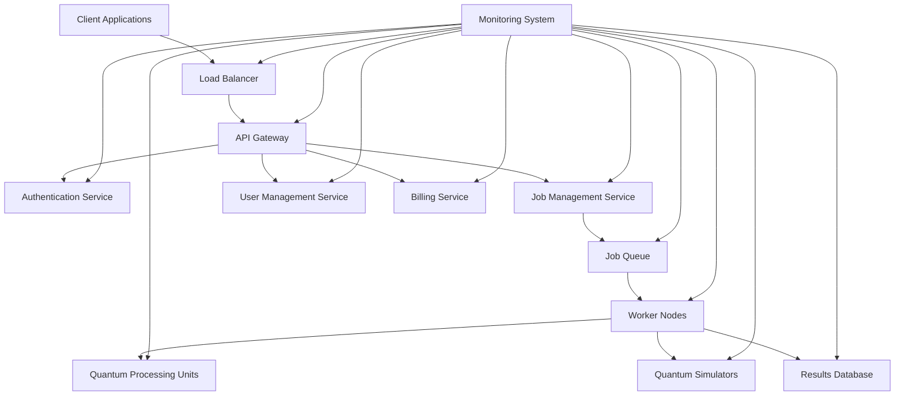
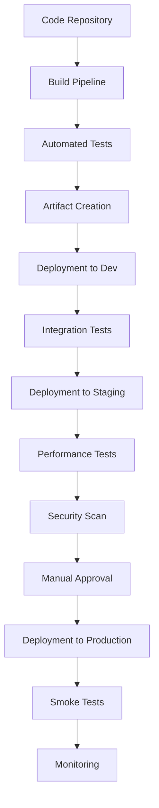

# Deployment & Infrastructure Guide

## Overview

This document outlines the deployment architecture, infrastructure components, and operational procedures for the Goliath Quantum Platform. It serves as a reference for DevOps engineers, system administrators, and platform operators.

## Architecture Overview



## Infrastructure Components

### Compute Resources

| Component | Specification | Quantity | Purpose |
|-----------|---------------|----------|---------|
| API Servers | 8 vCPU, 32GB RAM | 4 | Handle API requests |
| Worker Nodes | 16 vCPU, 64GB RAM | 8 | Process quantum jobs |
| Database Servers | 8 vCPU, 64GB RAM | 3 | Store platform data |
| Quantum Simulators | 32 vCPU, 128GB RAM | 4 | Simulate quantum circuits |
| Monitoring Servers | 4 vCPU, 16GB RAM | 2 | Platform monitoring |

### Storage Resources

| Component | Type | Size | Redundancy | Purpose |
|-----------|------|------|------------|---------|
| Database Storage | SSD | 2TB | RAID-10 | Primary database |
| Object Storage | S3-compatible | 10TB | 3x replication | Job results, datasets |
| Log Storage | SSD | 5TB | 2x replication | System and application logs |
| Backup Storage | HDD | 20TB | 3x replication | System backups |

### Network Resources

| Component | Specification | Purpose |
|-----------|---------------|---------|
| External Load Balancer | HA configuration | Client traffic distribution |
| Internal Load Balancer | HA configuration | Service-to-service communication |
| VPN Gateway | IPsec with AES-256 | Secure remote access |
| Firewall | Stateful inspection | Network security |
| CDN | Global edge locations | Static content delivery |

## Deployment Environments

### Production Environment

- **Region**: US-East, EU-Central
- **Availability Zones**: 3 per region
- **Failover Strategy**: Active-Active with global load balancing
- **Backup Schedule**: Daily incremental, weekly full
- **Monitoring**: 24/7 with automated alerting

### Staging Environment

- **Region**: US-East
- **Availability Zones**: 2
- **Configuration**: Mirror of production at 50% capacity
- **Purpose**: Pre-production testing, performance validation
- **Data**: Anonymized copy of production data

### Development Environment

- **Region**: US-East
- **Availability Zones**: 1
- **Configuration**: Minimal viable deployment
- **Purpose**: Feature development, integration testing
- **Data**: Synthetic test data

## Deployment Process

### Continuous Integration/Continuous Deployment



### Deployment Steps

1. **Build Artifacts**
   - Source: GitHub repository
   - Trigger: Commit to main branch or release tag
   - Output: Docker images, configuration packages

2. **Deploy to Development**
   - Frequency: Continuous on successful build
   - Approval: Automatic
   - Validation: Automated integration tests

3. **Deploy to Staging**
   - Frequency: Daily
   - Approval: Automatic if tests pass
   - Validation: Performance tests, security scans

4. **Deploy to Production**
   - Frequency: Weekly or on-demand
   - Approval: Manual by release manager
   - Validation: Smoke tests, canary deployment

### Rollback Procedure

1. **Automatic Rollback Triggers**
   - Critical error rate exceeds 0.1%
   - API response time exceeds 500ms for 5 minutes
   - Failed health checks on 25% of instances

2. **Manual Rollback Process**
   - Initiate from deployment dashboard
   - Select previous stable version
   - Execute staged rollback (25%, 50%, 100%)
   - Verify system stability after rollback

## Infrastructure as Code

All infrastructure is managed using Infrastructure as Code (IaC) principles:

### Terraform Configuration

- **Repository**: `github.com/goliath-quantum/infrastructure`
- **State Management**: Remote state in S3 with DynamoDB locking
- **Module Structure**:
  - `modules/networking`: VPC, subnets, security groups
  - `modules/compute`: EC2, EKS, Auto Scaling
  - `modules/storage`: RDS, S3, EFS
  - `modules/security`: IAM, KMS, WAF

### Kubernetes Configuration

- **Repository**: `github.com/goliath-quantum/k8s-config`
- **Cluster Management**: GitOps with ArgoCD
- **Resource Organization**:
  - `base/`: Common configurations
  - `overlays/dev/`: Development environment
  - `overlays/staging/`: Staging environment
  - `overlays/prod/`: Production environment

## Scaling Strategy

### Horizontal Scaling

- **API Tier**: Auto-scaling based on CPU utilization (target: 70%)
- **Worker Tier**: Auto-scaling based on job queue depth (target: <100 jobs)
- **Database Tier**: Read replicas with automated promotion

### Vertical Scaling

- **Quantum Simulators**: Scheduled scaling for large job processing
- **Database Primary**: Manual scaling during maintenance windows

### Global Scaling

- **Multi-Region Strategy**: Active-Active for API and Worker tiers
- **Data Replication**: Asynchronous with RPO of 15 minutes
- **Traffic Routing**: Latency-based with health check failover

## Security Configuration

### Network Security

- **Perimeter Protection**: WAF, DDoS protection
- **Segmentation**: Network ACLs, security groups
- **Encryption**: TLS 1.3 for all external traffic
- **VPN Access**: Certificate-based authentication

### Data Security

- **Encryption at Rest**: AES-256 for all storage
- **Encryption in Transit**: TLS 1.3 for all communications
- **Key Management**: AWS KMS with automatic rotation
- **Data Classification**: Automated tagging and access controls

### Access Control

- **Identity Provider**: Okta with SAML 2.0
- **Role-Based Access**: Least privilege principle
- **Privileged Access**: Just-in-time with approval workflow
- **Audit Logging**: All access events retained for 1 year

## Monitoring & Observability

### Monitoring Stack

- **Metrics**: Prometheus with Grafana dashboards
- **Logs**: ELK stack (Elasticsearch, Logstash, Kibana)
- **Traces**: Jaeger for distributed tracing
- **Alerts**: PagerDuty integration with escalation policies

### Key Metrics

| Category | Metric | Warning Threshold | Critical Threshold |
|----------|--------|-------------------|-------------------|
| Performance | API Response Time | >200ms | >500ms |
| Performance | Job Processing Time | >120% of baseline | >200% of baseline |
| Reliability | Error Rate | >0.1% | >1% |
| Reliability | Service Availability | <99.9% | <99% |
| Resource | CPU Utilization | >70% | >90% |
| Resource | Memory Utilization | >75% | >90% |
| Resource | Storage Utilization | >75% | >90% |
| Security | Failed Authentication | >10/minute | >50/minute |

### Dashboards

1. **Executive Dashboard**
   - Service health overview
   - SLA compliance metrics
   - User activity trends

2. **Operations Dashboard**
   - Real-time service status
   - Resource utilization
   - Alert history

3. **Developer Dashboard**
   - API performance metrics
   - Error rates by endpoint
   - Deployment status

## Disaster Recovery

### Backup Strategy

| Data Type | Backup Frequency | Retention Period | Storage Location |
|-----------|------------------|------------------|------------------|
| Database | Hourly incremental, Daily full | 30 days | Cross-region S3 |
| User Files | Daily | 90 days | Cross-region S3 |
| System Configurations | On change | 1 year | Version-controlled repository |
| Logs | Real-time | 1 year | Cross-region S3 |

### Recovery Procedures

1. **Database Recovery**
   - RTO: 1 hour
   - RPO: 15 minutes
   - Procedure: Automated restore from backup with manual verification

2. **Application Recovery**
   - RTO: 30 minutes
   - RPO: 0 minutes (stateless)
   - Procedure: Automated deployment from artifacts

3. **Full System Recovery**
   - RTO: 4 hours
   - RPO: 15 minutes
   - Procedure: Orchestrated recovery using runbooks

### Disaster Scenarios

1. **Availability Zone Failure**
   - Detection: Automated health checks
   - Response: Traffic redirection to healthy zones
   - Recovery: Auto-scaling in remaining zones

2. **Region Failure**
   - Detection: Regional health checks
   - Response: Traffic redirection to secondary region
   - Recovery: Promotion of secondary region to primary

3. **Data Corruption**
   - Detection: Data integrity checks
   - Response: Isolation of affected systems
   - Recovery: Point-in-time restore from backups

## Operational Procedures

### Routine Maintenance

| Task | Frequency | Impact | Notification Period |
|------|-----------|--------|---------------------|
| Security Patching | Monthly | No downtime | 7 days |
| Database Maintenance | Quarterly | Read-only mode for 30 minutes | 14 days |
| Infrastructure Updates | Quarterly | No downtime | 14 days |
| Full DR Test | Bi-annually | No impact to production | 30 days |

### Incident Response

1. **Severity Levels**
   - **SEV1**: Service unavailable, data loss risk
   - **SEV2**: Degraded performance, partial feature unavailability
   - **SEV3**: Minor issues, workarounds available
   - **SEV4**: Cosmetic issues, no functional impact

2. **Response Times**
   - **SEV1**: 15 minutes, 24/7
   - **SEV2**: 1 hour, 24/7
   - **SEV3**: 4 hours, business hours
   - **SEV4**: 2 business days

3. **Communication Channels**
   - **Internal**: Slack, Email, Phone
   - **External**: Status page, Email, Support portal

## Compliance & Governance

### Compliance Controls

- **SOC 2 Type II**: Annual audit
- **GDPR**: Privacy impact assessments
- **HIPAA**: Business Associate Agreement available
- **ISO 27001**: Annual certification

### Audit Logging

- **System Events**: All infrastructure changes
- **Security Events**: Authentication, authorization
- **Data Access**: All access to sensitive data
- **User Actions**: Administrative actions

### Change Management

- **Change Advisory Board**: Weekly meetings
- **Emergency Changes**: Post-implementation review
- **Change Windows**: Tuesday and Thursday, 10 PM - 2 AM UTC

## Appendix

### Network Diagram

```
                                  ┌─────────────────┐
                                  │   Internet      │
                                  └────────┬────────┘
                                           │
                                  ┌────────▼────────┐
                                  │  DDoS Protection │
                                  └────────┬────────┘
                                           │
                                  ┌────────▼────────┐
                                  │   Web Application│
                                  │     Firewall    │
                                  └────────┬────────┘
                                           │
                                  ┌────────▼────────┐
                                  │  Load Balancer  │
                                  └────────┬────────┘
                                           │
                 ┌───────────────┬─────────┴─────────┬───────────────┐
                 │               │                   │               │
        ┌────────▼────────┐     ┌▼─────────────────┐ │  ┌────────▼────────┐
        │  API Gateway    │     │  API Gateway     │ │  │  API Gateway    │
        │  (Zone A)       │     │  (Zone B)        │ │  │  (Zone C)       │
        └────────┬────────┘     └┬─────────────────┘ │  └────────┬────────┘
                 │               │                   │           │
        ┌────────▼────────┐     ┌▼─────────────────┐ │  ┌────────▼────────┐
        │  Service Mesh   │     │  Service Mesh    │ │  │  Service Mesh   │
        └┬───────┬───────┬┘     └┬────────┬───────┬┘ │  └┬───────┬───────┬┘
         │       │       │       │        │       │  │   │       │       │
┌────────▼─┐ ┌───▼───┐ ┌─▼──────┐ ┌──────▼─┐ ┌───▼───┐ ┌─▼──────┐ ┌───▼───┐ ┌─▼──────┐
│ Auth     │ │ Job   │ │ User   │ │ Auth   │ │ Job   │ │ User   │ │ Auth  │ │ Job   │ │ User   │
│ Service  │ │Service│ │ Service│ │ Service │ │Service│ │ Service│ │Service│ │Service│ │ Service│
└────────┬─┘ └───┬───┘ └────────┘ └────────┘ └───┬───┘ └────────┘ └───────┘ └───┬───┘ └────────┘
         │       │                             │                               │
         │  ┌────▼─────────────────────────────▼───────────────────────────────▼──┐
         │  │                           Message Queue                             │
         │  └────┬─────────────────────────────┬───────────────────────────────┬──┘
         │       │                             │                               │
┌────────▼─┐ ┌───▼───┐                    ┌────▼───┐                      ┌───▼───┐
│ Auth DB  │ │Job DB │                    │Worker 1│                      │Worker N│
│ Cluster  │ │Cluster│                    └────┬───┘                      └───┬───┘
└──────────┘ └───────┘                         │                              │
                                          ┌────▼───────────────────────────────▼──┐
                                          │              Quantum Backend          │
                                          └───────────────────────────────────────┘
```

### Resource Allocation

| Environment | vCPUs | Memory (GB) | Storage (TB) | Network (Gbps) |
|-------------|-------|-------------|--------------|----------------|
| Production  | 512   | 2048        | 50           | 25             |
| Staging     | 256   | 1024        | 25           | 10             |
| Development | 128   | 512         | 10           | 5              |

### Deployment Checklist

1. **Pre-Deployment**
   - [ ] All tests passing in CI pipeline
   - [ ] Security scan completed with no critical issues
   - [ ] Performance testing shows no degradation
   - [ ] Change request approved by CAB
   - [ ] Rollback plan documented and tested

2. **Deployment**
   - [ ] Maintenance window confirmed
   - [ ] Stakeholders notified
   - [ ] Database backups verified
   - [ ] Deployment team assembled
   - [ ] Monitoring dashboards open

3. **Post-Deployment**
   - [ ] Smoke tests passed
   - [ ] Canary metrics within acceptable range
   - [ ] Logs show no unexpected errors
   - [ ] Performance metrics within baseline
   - [ ] Deployment documented in change log

---

*Last Updated: July 2023*  
*Document Version: 1.0*  
*Contact: devops-team@goliath-quantum.com*