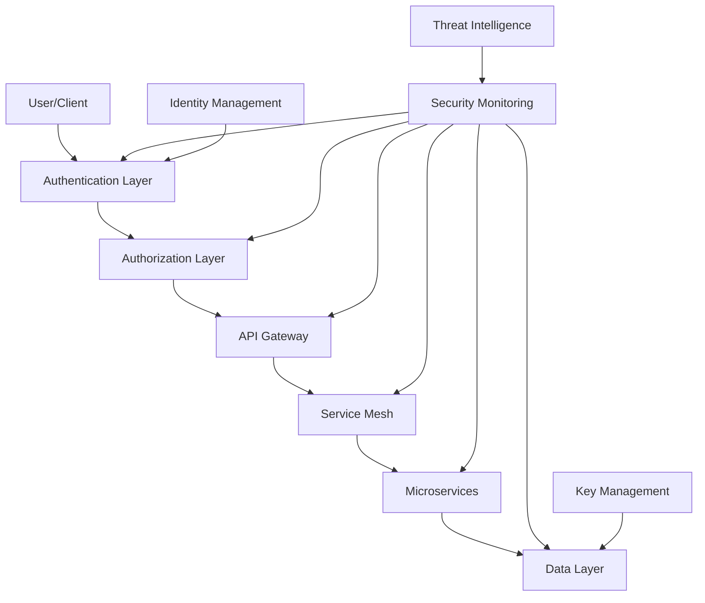
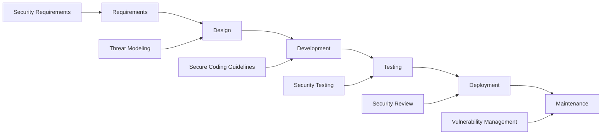
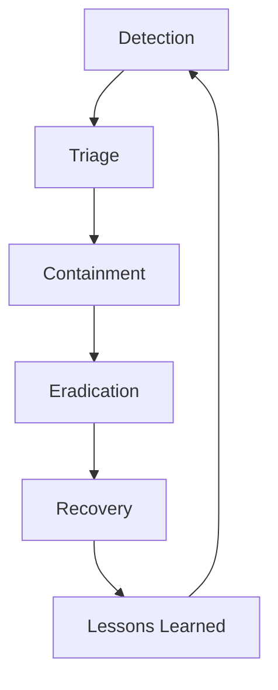

# Security Framework

## Overview

This document outlines the comprehensive security framework implemented across the Goliath Quantum Platform. It covers security policies, controls, implementation details, and compliance requirements to ensure the protection of sensitive quantum computing resources and data.

## Security Principles

The Goliath Quantum Platform security framework is built on the following core principles:

1. **Defense in Depth**: Multiple layers of security controls
2. **Least Privilege**: Minimal access rights for users and processes
3. **Zero Trust**: Verify all access attempts regardless of source
4. **Secure by Design**: Security integrated into development lifecycle
5. **Continuous Monitoring**: Real-time threat detection and response

## Security Architecture



## Identity and Access Management

### Authentication Methods

| Method | Use Case | Security Level |
|--------|----------|----------------|
| API Keys | Machine-to-machine | Medium |
| Username/Password + MFA | User portal access | High |
| OAuth 2.0 | Third-party integrations | High |
| SAML 2.0 | Enterprise SSO | Very High |
| Client Certificates | Critical infrastructure | Very High |

### Multi-Factor Authentication

MFA is mandatory for all user accounts and supports:

- Time-based One-Time Passwords (TOTP)
- Hardware security keys (FIDO2/WebAuthn)
- Push notifications to mobile devices
- Biometric authentication (where supported)

### Role-Based Access Control

| Role | Description | Access Level |
|------|-------------|--------------|
| Administrator | Platform management | Full system access |
| Operator | Day-to-day operations | Service management |
| Developer | Application development | API and development tools |
| Researcher | Quantum algorithm research | Job submission and results |
| Auditor | Compliance monitoring | Read-only access to logs and configurations |
| Billing | Financial management | Usage and billing information |

### Privileged Access Management

- Just-in-Time (JIT) access for administrative functions
- Approval workflows for sensitive operations
- Session recording for all privileged activities
- Automatic session termination after inactivity
- Credential vaulting for service accounts

## Data Security

### Data Classification

| Level | Description | Examples | Controls |
|-------|-------------|----------|----------|
| Public | Non-sensitive information | Marketing materials, public documentation | No restrictions |
| Internal | Business information | Internal communications, non-sensitive configurations | Authentication required |
| Confidential | Sensitive business information | Customer data, financial information | Encryption, access controls |
| Restricted | Highly sensitive information | Cryptographic keys, proprietary algorithms | Encryption, strict access controls, audit logging |

### Encryption Standards

| Data State | Encryption Standard | Key Management |
|------------|---------------------|---------------|
| Data at Rest | AES-256-GCM | HSM-backed KMS |
| Data in Transit | TLS 1.3 | Automated certificate management |
| Data in Use | Confidential Computing | Secure enclaves |

### Key Management

- Hardware Security Module (HSM) for root key protection
- Automated key rotation schedules
- Key usage auditing and monitoring
- Separation of duties for key management operations
- Secure key backup and recovery procedures

## Network Security

### Network Segmentation

```
┌─────────────────────────────────────────────────────────────┐
│                      Internet                               │
└───────────────────────────┬─────────────────────────────────┘
                            │
┌───────────────────────────▼─────────────────────────────────┐
│                      DMZ Network                            │
│  ┌─────────────┐    ┌─────────────┐    ┌─────────────┐      │
│  │ WAF         │    │ Load        │    │ Bastion     │      │
│  │             │    │ Balancers   │    │ Hosts       │      │
│  └─────────────┘    └─────────────┘    └─────────────┘      │
└───────────────────────────┬─────────────────────────────────┘
                            │
┌───────────────────────────▼─────────────────────────────────┐
│                   Application Network                       │
│  ┌─────────────┐    ┌─────────────┐    ┌─────────────┐      │
│  │ API         │    │ Web         │    │ Application │      │
│  │ Servers     │    │ Servers     │    │ Servers     │      │
│  └─────────────┘    └─────────────┘    └─────────────┘      │
└───────────────────────────┬─────────────────────────────────┘
                            │
┌───────────────────────────▼─────────────────────────────────┐
│                    Service Network                          │
│  ┌─────────────┐    ┌─────────────┐    ┌─────────────┐      │
│  │ Internal    │    │ Worker      │    │ Message     │      │
│  │ Services    │    │ Nodes       │    │ Queues      │      │
│  └─────────────┘    └─────────────┘    └─────────────┘      │
└───────────────────────────┬─────────────────────────────────┘
                            │
┌───────────────────────────▼─────────────────────────────────┐
│                     Data Network                            │
│  ┌─────────────┐    ┌─────────────┐    ┌─────────────┐      │
│  │ Database    │    │ Storage     │    │ Backup      │      │
│  │ Servers     │    │ Systems     │    │ Systems     │      │
│  └─────────────┘    └─────────────┘    └─────────────┘      │
└─────────────────────────────────────────────────────────────┘
```

### Perimeter Security

- Web Application Firewall (WAF) with custom rule sets
- DDoS protection with traffic analysis and filtering
- API rate limiting and throttling
- IP-based access controls with geofencing
- Deep packet inspection for malicious traffic

### Secure Communication

- TLS 1.3 for all external communications
- Mutual TLS (mTLS) for service-to-service communication
- Certificate pinning for critical connections
- Automated certificate lifecycle management
- Perfect forward secrecy for all encrypted connections

## Application Security

### Secure Development Lifecycle



### Security Controls

| Category | Control | Implementation |
|----------|---------|----------------|
| Input Validation | Parameter validation | Server-side validation with strict schemas |
| Authentication | Multi-factor authentication | TOTP, FIDO2, SMS |
| Authorization | Role-based access control | Policy-based enforcement |
| Session Management | Secure session handling | Encrypted, time-limited tokens |
| Error Handling | Secure error messages | Generic errors to users, detailed logs for debugging |
| Logging | Security event logging | Centralized, tamper-evident logging |
| Rate Limiting | Request throttling | Per-user and per-IP limits |

### Vulnerability Management

- Automated static application security testing (SAST)
- Dynamic application security testing (DAST)
- Software composition analysis (SCA)
- Regular penetration testing
- Bug bounty program
- Vulnerability disclosure policy

## Infrastructure Security

### Server Hardening

- Minimal base images with only required components
- Regular security patching with automated deployment
- Host-based intrusion detection and prevention
- File integrity monitoring
- Endpoint protection with behavioral analysis

### Container Security

- Minimal, hardened container images
- Image scanning for vulnerabilities
- Runtime protection with behavioral monitoring
- Enforced pod security policies
- Network policy enforcement

### Cloud Security

- Infrastructure as Code with security validation
- Cloud Security Posture Management (CSPM)
- Cloud Workload Protection Platform (CWPP)
- Identity and Access Management (IAM) with least privilege
- Resource tagging and inventory management

## Monitoring and Incident Response

### Security Monitoring

- Security Information and Event Management (SIEM)
- User and Entity Behavior Analytics (UEBA)
- Network traffic analysis
- Endpoint detection and response
- Cloud security monitoring

### Incident Response Process



### Incident Severity Levels

| Level | Description | Response Time | Notification |
|-------|-------------|---------------|-------------|
| Critical | System breach, data exfiltration | Immediate | Executive team, customers |
| High | Active attack, limited impact | < 1 hour | Security team, management |
| Medium | Suspicious activity, potential threat | < 4 hours | Security team |
| Low | Policy violation, minor issue | < 24 hours | Team lead |

### Incident Response Team

- Security Operations Center (SOC) analysts
- Incident Response specialists
- Forensic investigators
- Legal counsel
- Communications team
- Executive leadership

## Compliance and Governance

### Regulatory Compliance

| Regulation | Scope | Key Requirements |
|------------|-------|------------------|
| GDPR | EU personal data | Data protection, breach notification, data subject rights |
| HIPAA | US healthcare data | PHI protection, business associate agreements |
| SOC 2 | Service organizations | Security, availability, processing integrity, confidentiality, privacy |
| ISO 27001 | Information security | ISMS implementation, risk management |
| NIST 800-53 | Federal systems | Security and privacy controls |

### Security Policies

- Information Security Policy
- Access Control Policy
- Data Classification and Handling Policy
- Acceptable Use Policy
- Incident Response Policy
- Business Continuity Policy
- Vendor Management Policy
- Security Awareness and Training Policy

### Security Governance

- Security Steering Committee
- Risk Management Framework
- Security Metrics and KPIs
- Regular security assessments
- Third-party security reviews
- Continuous compliance monitoring

## Quantum-Specific Security Considerations

### Quantum Key Distribution (QKD)

- Implementation of quantum-resistant cryptography
- Hybrid classical-quantum encryption schemes
- Key distribution protocols resistant to quantum attacks
- Post-quantum cryptographic algorithms

### Quantum Algorithm Security

- Secure storage of quantum algorithms
- Intellectual property protection
- Quantum circuit obfuscation techniques
- Secure multi-party quantum computation

### Quantum Hardware Security

- Physical security for quantum processing units
- Environmental controls for quantum hardware
- Supply chain security for quantum components
- Tamper detection and prevention

## Security Training and Awareness

### Training Programs

| Audience | Training Type | Frequency |
|----------|---------------|-----------|
| All Staff | Security Awareness | Quarterly |
| Developers | Secure Coding | Bi-annually |
| Operations | Security Operations | Annually |
| Executives | Security Governance | Annually |
| New Hires | Security Onboarding | Upon hiring |

### Awareness Campaigns

- Phishing simulations
- Security newsletters
- Security champions program
- Capture the flag (CTF) competitions
- Security brown bag sessions

## Appendix

### Security Tools and Technologies

| Category | Tools |
|----------|-------|
| Authentication | Okta, Auth0, Azure AD |
| Encryption | AWS KMS, HashiCorp Vault, Google Cloud KMS |
| Network Security | Palo Alto Networks, Cloudflare, AWS WAF |
| Application Security | Snyk, Checkmarx, OWASP ZAP |
| Monitoring | Splunk, Elastic Stack, Datadog |
| Endpoint Security | CrowdStrike, Carbon Black, SentinelOne |

### Security Assessment Checklist

1. **Authentication and Authorization**
   - [ ] MFA enabled for all user accounts
   - [ ] Role-based access control implemented
   - [ ] Regular access reviews conducted
   - [ ] Password policies enforced

2. **Data Protection**
   - [ ] Data classified according to sensitivity
   - [ ] Encryption implemented for sensitive data
   - [ ] Data loss prevention controls in place
   - [ ] Data retention policies enforced

3. **Network Security**
   - [ ] Network segmentation implemented
   - [ ] Firewall rules reviewed and updated
   - [ ] Intrusion detection/prevention systems active
   - [ ] VPN access secured with MFA

4. **Application Security**
   - [ ] Input validation implemented
   - [ ] Output encoding used
   - [ ] CSRF protection in place
   - [ ] Security headers configured

5. **Infrastructure Security**
   - [ ] Systems patched and up to date
   - [ ] Hardening standards applied
   - [ ] Vulnerability scanning performed
   - [ ] Secure configuration management

### Security Response Contacts

- **Security Incidents**: security-incidents@goliath-quantum.com
- **Vulnerability Reports**: security@goliath-quantum.com
- **Compliance Inquiries**: compliance@goliath-quantum.com
- **Security Emergency**: +1-555-123-4567 (24/7 hotline)

---

*Last Updated: July 2023*  
*Document Version: 1.0*  
*Contact: security-team@goliath-quantum.com*