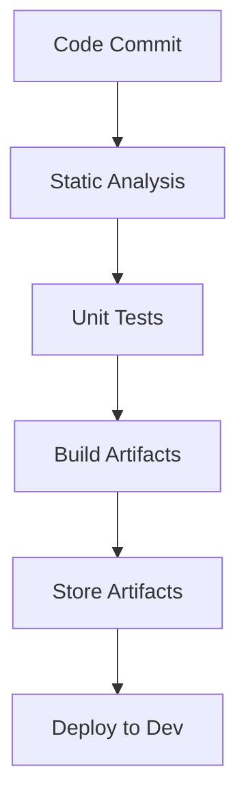
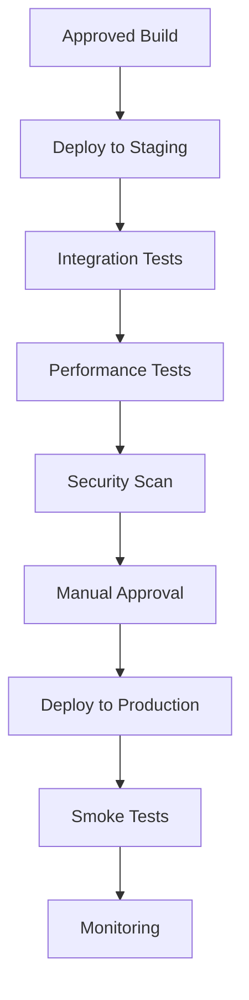
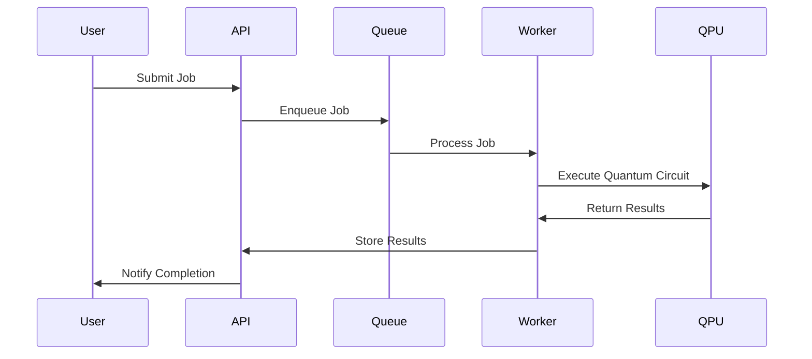
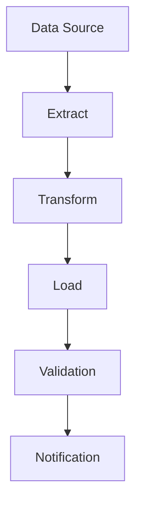
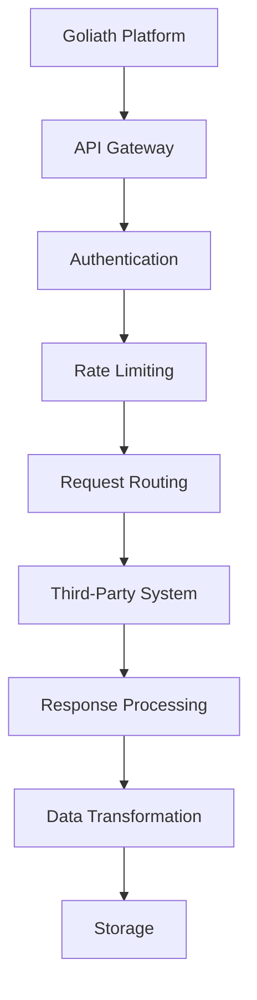
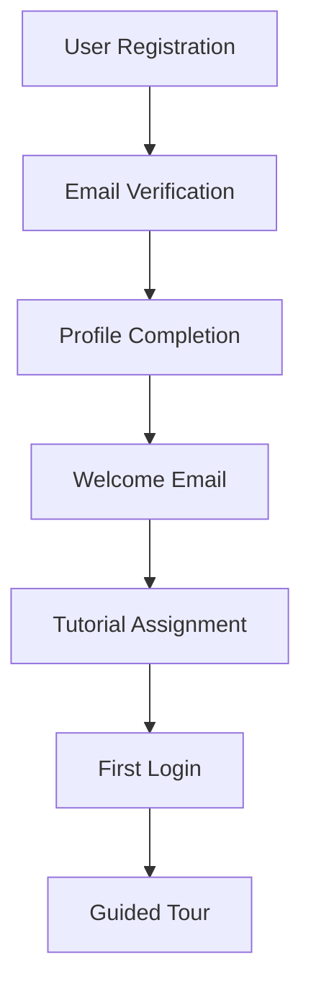
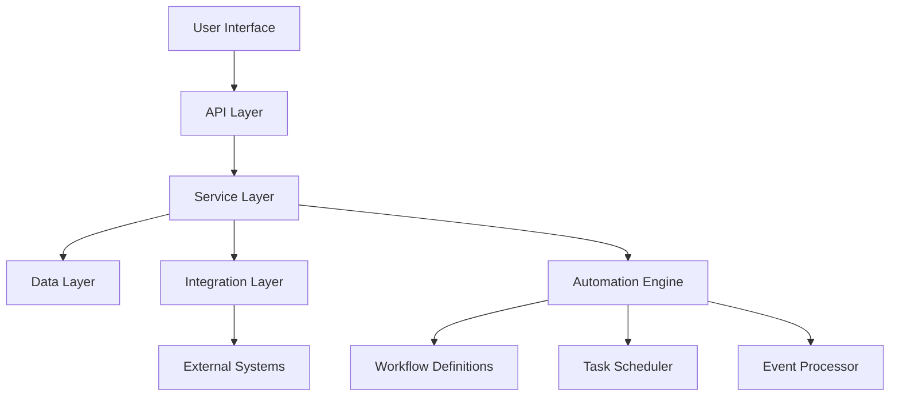

# Workflow Automation Guide

## Overview

This document outlines the workflow automation capabilities of the Goliath Quantum Platform, including CI/CD pipelines, job processing workflows, and system integrations. It serves as a comprehensive reference for developers and administrators working with the platform's automation features.

## CI/CD Pipelines

### Build Pipeline

#### Configuration

The build pipeline is configured in `.github/workflows/build.yml` with the following key components:

- **Triggers**: Commits to main and develop branches
- **Environment**: Ubuntu 20.04 with Python 3.9
- **Steps**:
  1. Code checkout
  2. Environment setup
  3. Dependency installation
  4. Linting and static analysis
  5. Unit test execution
  6. Artifact building
  7. Artifact storage
  8. Development environment deployment

#### Usage

To use the build pipeline:

1. Commit code to a feature branch
2. Create a pull request to the develop branch
3. CI pipeline will automatically run
4. Review test results and code quality metrics
5. Merge if all checks pass

### Deployment Pipeline

#### Configuration

The deployment pipeline is configured in `.github/workflows/deploy.yml` with these key components:

- **Triggers**: Manual approval or scheduled releases
- **Environments**: Staging and Production
- **Steps**:
  1. Artifact retrieval
  2. Environment configuration
  3. Deployment execution
  4. Post-deployment testing
  5. Monitoring setup

#### Usage

To trigger a deployment:

1. Navigate to GitHub Actions
2. Select the deploy workflow
3. Choose the target environment
4. Initiate the workflow
5. Monitor progress and approve production deployment when ready

## Quantum Job Processing Workflow

### Job Submission Flow

### Configuration

Job processing is configured through the following components:

- **API Configuration**: `api/src/main.py`
- **Queue Configuration**: `worker/config/queue.yaml`
- **Worker Configuration**: `worker/worker.py`
- **Notification Configuration**: `services/notifications/config.yaml`

### Monitoring and Alerting

Job processing is monitored through:

- **Dashboard**: Real-time job status visualization
- **Alerts**: Configured for job failures and processing delays
- **Logs**: Centralized logging for all job processing steps

## Data Processing Automation

### ETL Workflows

### Scheduled Tasks

The platform includes the following scheduled automation tasks:

| Task | Schedule | Description | Configuration |
|------|----------|-------------|---------------|
| Usage Reports | Daily at 00:00 UTC | Generates daily usage reports | `scripts/reports/usage.py` |
| Database Backup | Daily at 02:00 UTC | Performs database backups | `scripts/backup/db_backup.sh` |
| Log Rotation | Weekly on Sunday | Rotates and archives logs | `scripts/maintenance/log_rotate.sh` |
| Performance Analytics | Hourly | Collects and analyzes performance metrics | `monitoring/performance_analytics.py` |

### Configuration

Scheduled tasks are configured through:

- **Cron Jobs**: System-level scheduling
- **Task Scheduler**: Application-level task scheduling
- **Configuration Files**: `config/scheduled_tasks.yaml`

## Integration Automation

### Third-Party System Integration

### Webhook Processing

The platform processes webhooks from third-party systems through:

1. **Endpoint Registration**: `api/routes/webhooks.py`
2. **Payload Validation**: `api/src/security/webhook_validator.py`
3. **Event Processing**: `services/webhook_processor.py`
4. **Action Triggering**: `services/action_handler.py`

### Configuration

Integration automation is configured through:

- **API Gateway Configuration**: `api/src/routes/gateway.py`
- **Integration Profiles**: `config/integrations/*.yaml`
- **Authentication Settings**: `api/src/security/integration_auth.py`

## User Workflow Automation

### User Onboarding

### Notification System

The platform includes automated notifications for:

- **Job Status Changes**: When quantum jobs change status
- **System Alerts**: For maintenance or issues
- **Usage Quotas**: When approaching or exceeding quotas
- **Security Events**: For suspicious activities

### Configuration

User workflow automation is configured through:

- **Onboarding Configuration**: `config/user/onboarding.yaml`
- **Notification Templates**: `templates/notifications/*.html`
- **Delivery Settings**: `config/notifications/channels.yaml`

## Troubleshooting Automation Issues

### Common Issues and Solutions

| Issue | Possible Causes | Solutions |
|-------|----------------|-----------|
| Failed CI Build | Dependency issues, test failures | Check logs, update dependencies, fix failing tests |
| Stuck Jobs | Resource constraints, deadlocks | Check worker logs, restart workers, increase resources |
| Failed Deployments | Environment configuration, permission issues | Verify environment variables, check permissions |
| Webhook Failures | Network issues, payload validation | Check network connectivity, verify payload format |

### Logging and Monitoring

To troubleshoot automation issues:

1. **Check Logs**: `logs/automation/*.log`
2. **Monitor Dashboards**: Grafana dashboards for system metrics
3. **Review Alerts**: Alert history in monitoring system
4. **Inspect Configurations**: Verify configuration files for errors

## Security Considerations

### Automation Security

All automation workflows implement:

- **Least Privilege**: Minimal permissions for each automation task
- **Secrets Management**: Secure handling of credentials and tokens
- **Audit Logging**: Comprehensive logging of all automation actions
- **Input Validation**: Strict validation of all inputs to prevent injection attacks

### Configuration

Security for automation is configured through:

- **IAM Policies**: `security/policies/*.json`
- **Secrets Management**: `security/secrets/config.yaml`
- **Audit Configuration**: `monitoring/audit/config.yaml`

## Best Practices

### Workflow Design

1. **Idempotency**: Design workflows to be safely repeatable
2. **Fault Tolerance**: Include error handling and recovery mechanisms
3. **Observability**: Add comprehensive logging and monitoring
4. **Versioning**: Version all workflow definitions
5. **Documentation**: Document workflow purpose, inputs, outputs, and error scenarios

### Implementation

1. **Testing**: Test workflows thoroughly, including failure scenarios
2. **Isolation**: Isolate workflows to prevent cascading failures
3. **Throttling**: Implement rate limiting to prevent resource exhaustion
4. **Timeouts**: Set appropriate timeouts for all operations
5. **Retries**: Implement retry mechanisms with exponential backoff

## Appendix

### Reference Architecture

### Configuration Reference

| Component | Configuration File | Description |
|-----------|-------------------|-------------|
| CI/CD | `.github/workflows/*.yml` | CI/CD pipeline definitions |
| Job Processing | `worker/config/*.yaml` | Job processing configuration |
| Scheduled Tasks | `config/scheduled_tasks.yaml` | Scheduled task definitions |
| Integrations | `config/integrations/*.yaml` | Third-party integration settings |
| User Workflows | `config/user/*.yaml` | User-related workflow settings |
| Security | `security/policies/*.json` | Security policy definitions |

---

*Last Updated: July 2023*  
*Document Version: 1.0*  
*Contact: automation-team@goliath-quantum.com*