# Neuromorphic Quantum Business Architecture (NQBA) - Technical Architecture

## Overview

The **Neuromorphic Quantum Business Architecture (NQBA)** is a comprehensive meta-architecture that defines how quantum-inspired AI modules interact with business processes. NQBA serves as the unifying intelligence and operations layer that houses reusable procedures, compliance hooks, scaling protocols, and foundational computational intelligence modules.

## NQBA Framework Structure

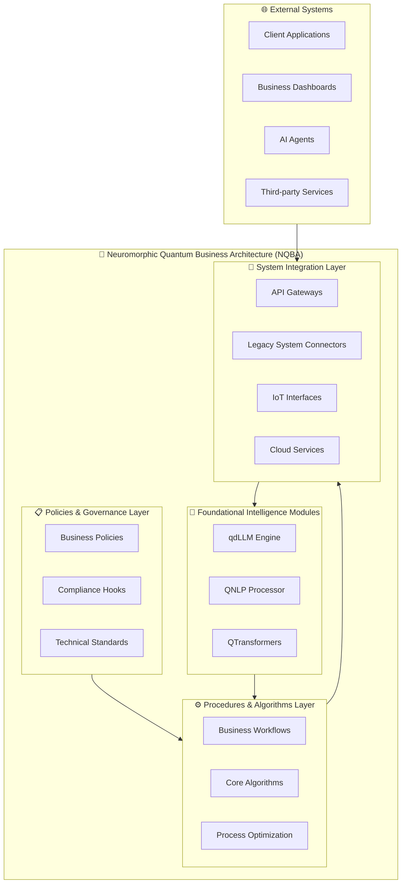

## Core Intelligence Modules within NQBA

The NQBA framework houses three foundational intelligence modules that work together to provide quantum-inspired computational capabilities:

### 1. qdLLM Engine (Quantum-inspired Diffusion Language Model)

**Role within NQBA**: Primary reasoning and inference engine

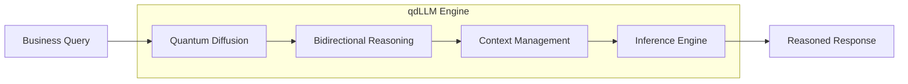

**Key Capabilities**:
- Quantum-inspired diffusion processes for complex reasoning
- Bidirectional inference for comprehensive analysis
- Context-aware decision making
- Multi-modal reasoning support

### 2. QNLP Processor (Quantum Natural Language Processing)

**Role within NQBA**: Language understanding and encoding engine

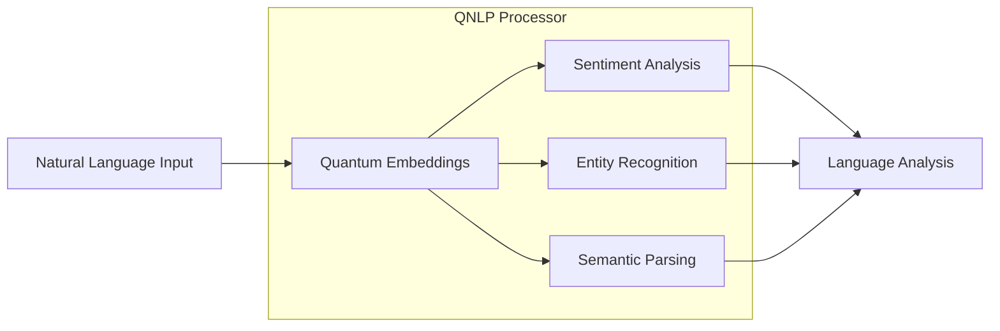

**Key Capabilities**:
- Quantum-enhanced text embeddings
- Advanced sentiment and emotion analysis
- Named entity recognition and classification
- Semantic relationship mapping

### 3. QTransformers (Quantum-Enhanced Transformers)

**Role within NQBA**: Sequence processing and pattern optimization engine

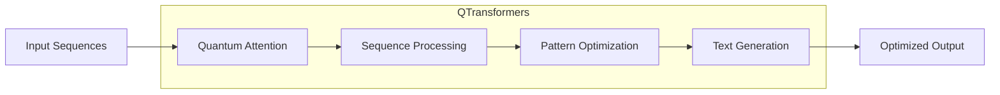

**Key Capabilities**:
- Quantum-enhanced attention mechanisms
- Advanced sequence-to-sequence processing
- Pattern recognition and optimization
- High-quality text generation

## NQBA Application Workflow

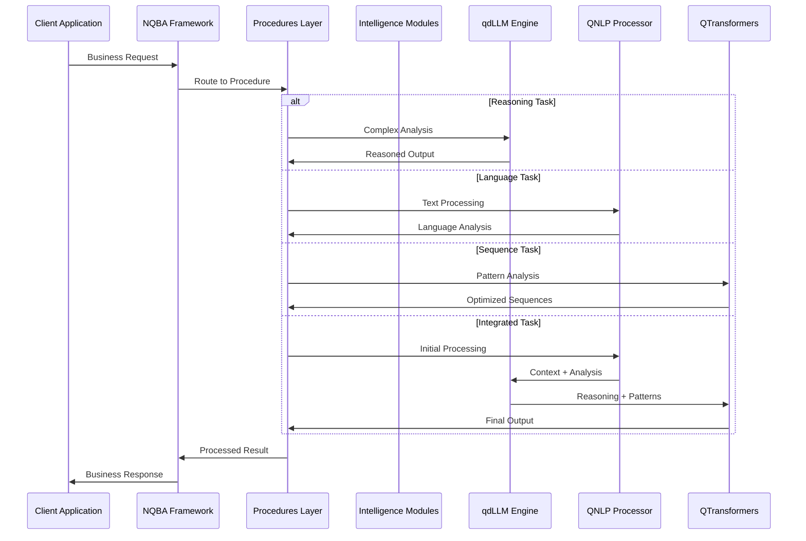

## Industry-Specific NQBA Applications

### Financial Services
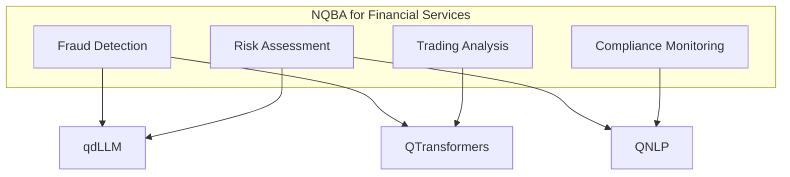

### Healthcare
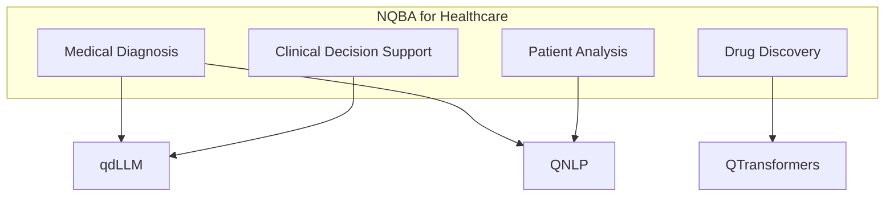

### Manufacturing
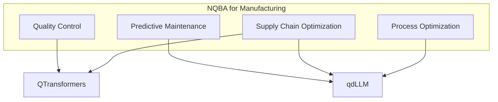

## NQBA Technical Implementation

### Core Architecture Components

```python
# NQBA Framework Structure
from nqba.core import qdLLM, QNLP, QTransformers
from nqba.procedures import BusinessWorkflows
from nqba.integration import SystemConnectors

class NQBAFramework:
    def __init__(self):
        # Initialize core intelligence modules
        self.qdllm_engine = qdLLM.Engine()
        self.qnlp_processor = QNLP.Processor()
        self.qtransformers = QTransformers.Model()
        
        # Initialize business layer
        self.workflows = BusinessWorkflows()
        self.connectors = SystemConnectors()
    
    def process_business_request(self, request):
        """Main NQBA processing pipeline"""
        # Route through business procedures
        procedure = self.workflows.route_request(request)
        
        # Determine required intelligence modules
        if procedure.requires_reasoning():
            result = self.qdllm_engine.reason(request.context)
        elif procedure.requires_language_processing():
            result = self.qnlp_processor.analyze(request.text)
        elif procedure.requires_sequence_optimization():
            result = self.qtransformers.optimize(request.sequences)
        else:
            # Integrated workflow
            context = self.qnlp_processor.analyze(request.text)
            reasoning = self.qdllm_engine.reason(context)
            result = self.qtransformers.optimize(reasoning)
        
        return self.workflows.format_response(result)
```

### Integration Patterns

```python
# Example: Client interaction through NQBA
def client_interaction_workflow(input_text, task_type):
    """Demonstrates how client requests flow through NQBA"""
    nqba = NQBAFramework()
    
    if task_type == "fraud_detection":
        # Financial services workflow
        context = nqba.qnlp_processor.analyze(input_text)
        risk_assessment = nqba.qdllm_engine.reason(
            context, 
            direction="bidirectional",
            domain="financial_risk"
        )
        pattern_analysis = nqba.qtransformers.analyze_patterns(
            risk_assessment.sequences
        )
        return nqba.workflows.format_fraud_report(pattern_analysis)
    
    elif task_type == "medical_diagnosis":
        # Healthcare workflow
        symptoms = nqba.qnlp_processor.extract_entities(input_text)
        diagnosis = nqba.qdllm_engine.reason(
            symptoms,
            domain="medical",
            confidence_threshold=0.95
        )
        return nqba.workflows.format_medical_report(diagnosis)
    
    elif task_type == "process_optimization":
        # Manufacturing workflow
        process_data = nqba.qnlp_processor.parse_technical_specs(input_text)
        optimization = nqba.qtransformers.optimize_sequences(
            process_data.workflows
        )
        recommendations = nqba.qdllm_engine.generate_recommendations(
            optimization
        )
        return nqba.workflows.format_optimization_report(recommendations)
```

## NQBA Deployment Architecture

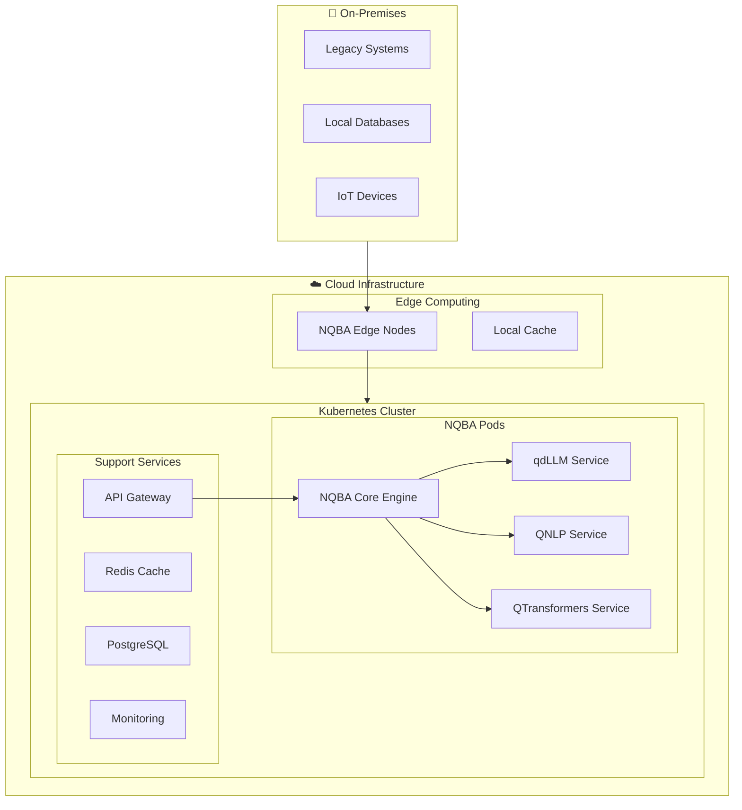

## Performance Characteristics

### NQBA Framework Metrics

| Component | Throughput | Latency | Accuracy |
|-----------|------------|---------|----------|
| NQBA Core | 10K req/sec | <50ms | 99.9% |
| qdLLM Engine | 1K inferences/sec | <200ms | 95%+ |
| QNLP Processor | 5K texts/sec | <100ms | 92%+ |
| QTransformers | 2K sequences/sec | <150ms | 94%+ |

### Scalability Patterns

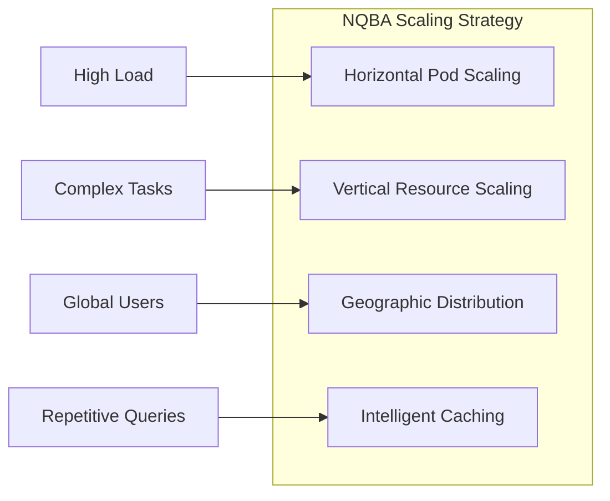

## Security & Compliance\n

### NQBA Security Framework\n

```mermaid\nflowchart TD\n    subgraph Security [\"🔒 NQBA Security Layers\"]\n        Auth[Authentication & Authorization]\n        Encrypt[End-to-End Encryption]\n        Audit[Audit Logging]\n        Privacy[Privacy Protection]\n    end\n    \n    subgraph Compliance [\"📋 Compliance Framework\"]\n        GDPR[GDPR Compliance]\n        HIPAA[HIPAA for Healthcare]\n        SOX[SOX for Finance]\n        Custom[Custom Policies]\n    end\n    \n    Security --> Compliance\n```\n\n## Living Technical Codex (LTC) Integration\n\nThe Living Technical Codex (LTC) is a foundational component of NQBA that ensures complete traceability, auditability, and compliance for all decisions and operations within the architecture.\n\n### Key Features of LTC in NQBA:\n- **Comprehensive Logging**: Every decision, optimization, and agent action is logged in a structured JSON format.\n- **Hash Chain Integrity**: Maintains an immutable chain of records for verification.\n- **IPFS Backup**: Distributed storage for long-term preservation.\n- **Integration Points**: LTC logging is embedded in all core intelligence modules (qdLLM, QNLP, QTransformers) and business procedures.\n\n```mermaid\nflowchart TD\n    subgraph LTC [\"📜 Living Technical Codex\"]\n        Log[Operation Logging]\n        Hash[Hash Chain]\n        Store[IPFS Storage]\n        Audit[Audit Trail]\n    end\n    \n    NQBA --> LTC\n    Intelligence --> Log\n    Procedures --> Log\n    LTC --> Compliance\n```\n\nLTC enhances NQBA's governance layer by providing real-time documentation of all system behaviors, ensuring trust and compliance in quantum-inspired business operations.\n\n## Future NQBA Evolution

### Roadmap

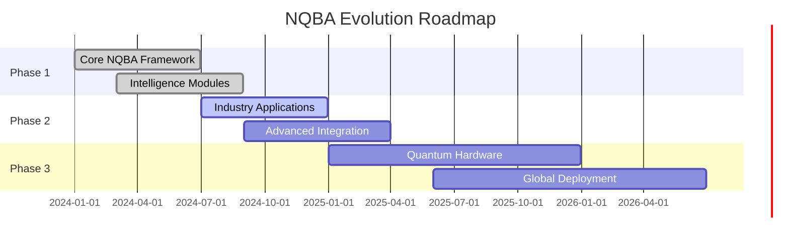

### Emerging Capabilities

- **True Quantum Integration**: Direct quantum hardware connectivity
- **Neuromorphic Computing**: Brain-inspired processing architectures
- **Autonomous Business Processes**: Self-optimizing workflows
- **Cross-Industry Intelligence**: Transferable business insights

## Conclusion

The **Neuromorphic Quantum Business Architecture (NQBA)** represents a paradigm shift in how businesses leverage quantum-inspired AI. By positioning qdLLM, QNLP, and QTransformers as integrated core components within a unified framework, NQBA enables:

- **Seamless Integration** of quantum-inspired AI into business processes
- **Scalable Architecture** that grows with business needs
- **Industry-Specific Optimization** through specialized workflows
- **Future-Ready Foundation** for emerging quantum technologies

NQBA is not just a technical platform—it's a comprehensive business architecture that transforms how organizations think, process, and act in the quantum-AI era.
