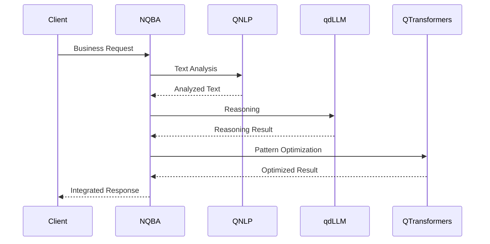
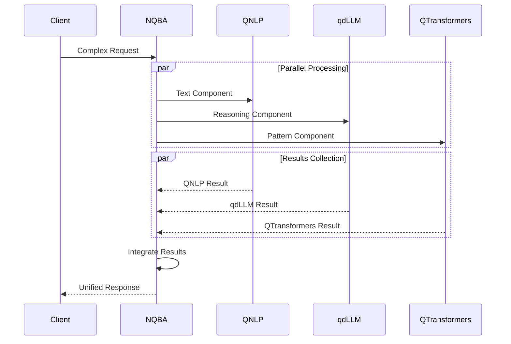
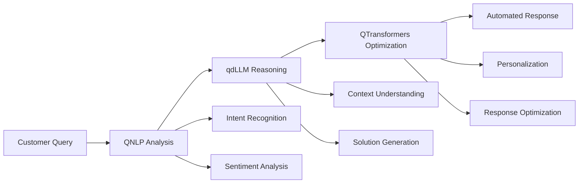
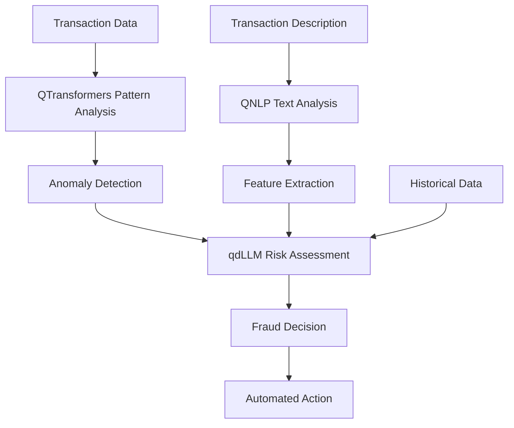
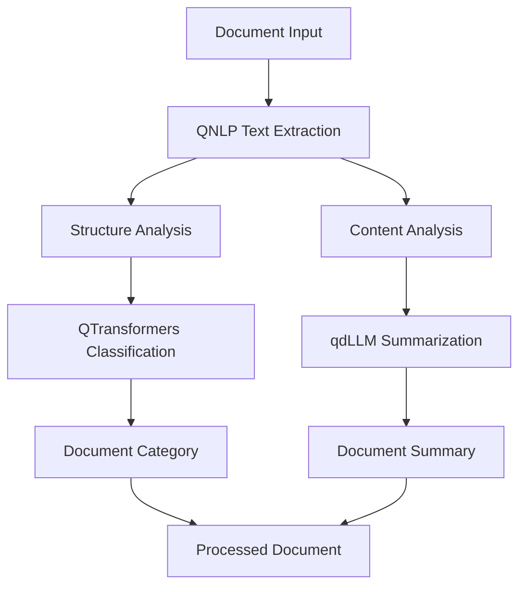

# NQBA Technical Blueprint
## Neuromorphic Quantum Business Architecture - Comprehensive Framework Specification

### Executive Summary

The Neuromorphic Quantum Business Architecture (NQBA) is a comprehensive meta-architecture that defines how quantum-inspired AI modules interact with business processes. It serves as the unifying intelligence and operations layer that houses reusable procedures, compliance hooks, scaling protocols, and foundational computational intelligence modules.

### Framework Overview

NQBA positions itself as the central orchestration framework with three core intelligence subcomponents:
- **qdLLM**: Quantum-inspired Large Language Model engine
- **QNLP**: Quantum Natural Language Processing
- **QTransformers**: Quantum-enhanced transformer architectures

```mermaid
graph TB
    subgraph "NQBA Framework - Neuromorphic Quantum Business Architecture"
        subgraph "Governance Layer"
            POL[Policies]
            COMP[Compliance]
            AUD[Audit Trail]
            SEC[Security]
        end
        
        subgraph "API Layer"
            REST[REST Endpoints]
            WS[WebSocket]
            AUTH[Authentication]
            RATE[Rate Limiting]
        end
        
        subgraph "Integration Layer"
            CONN[System Connectors]
            ADAPT[Protocol Adapters]
            BRIDGE[Legacy Bridges]
            GATE[Service Gateways]
        end
        
        subgraph "Procedures Layer"
            WF[Business Workflows]
            ALG[Algorithms]
            TEMP[Templates]
            ORCH[Orchestration]
        end
        
        subgraph "Core Intelligence Layer"
            subgraph "qdLLM Engine"
                QDE[Quantum Diffusion Engine]
                REV[Reversal Algorithms]
                DIFF[Forward/Backward Diffusion]
                SCORE[Coherence Scoring]
                MERGE[Coherence Merge]
            end
            
            subgraph "QNLP Processor"
                PROC[QNLP Processor]
                EMB[Quantum Embeddings]
                ENT[Semantic Entanglement]
                COH[Contextual Coherence]
                TOK[Quantum Tokenizer]
            end
            
            subgraph "QTransformers"
                BLOCK[QTransformer Blocks]
                ATT[Quantum Attention]
                FF[Quantum FeedForward]
                MODEL[QTransformer Model]
                POS[Positional Encoding]
            end
        end
        
        subgraph "Framework Orchestration"
            CORE[NQBA Framework Core]
            CONFIG[Configuration]
            MONITOR[Monitoring]
            HEALTH[Health Checks]
        end
    end
    
    %% External Systems
    EXT[External Systems]
    DB[(Databases)]
    CLOUD[Cloud Services]
    IOT[IoT Devices]
    LEGACY[Legacy Systems]
    
    %% Connections
    EXT --> API
    DB --> CONN
    CLOUD --> GATE
    IOT --> ADAPT
    LEGACY --> BRIDGE
    
    API --> CORE
    CONN --> CORE
    WF --> QDE
    WF --> PROC
    WF --> BLOCK
    
    POL --> CORE
    COMP --> AUD
    
    CORE --> QDE
    CORE --> PROC
    CORE --> BLOCK
    
    classDef intelligence fill:#e1f5fe
    classDef governance fill:#f3e5f5
    classDef integration fill:#e8f5e8
    classDef procedures fill:#fff3e0
    classDef api fill:#fce4ec
    
    class QDE,REV,DIFF,SCORE,MERGE,PROC,EMB,ENT,COH,TOK,BLOCK,ATT,FF,MODEL,POS intelligence
    class POL,COMP,AUD,SEC governance
    class CONN,ADAPT,BRIDGE,GATE integration
    class WF,ALG,TEMP,ORCH procedures
    class REST,WS,AUTH,RATE api
```



### Architecture Layers

#### 1. Core Intelligence Layer

The foundational layer containing the three primary intelligence modules:

##### qdLLM Engine
- **Purpose**: Quantum-inspired reasoning and inference
- **Components**:
  - Quantum Diffusion Engine: Core processing unit
  - Reversal Algorithms: Bidirectional reasoning
  - Forward/Backward Diffusion: Multi-directional processing
  - Coherence Scoring: Quality measurement
  - Coherence Merge: Result integration

##### QNLP Processor
- **Purpose**: Quantum-enhanced natural language processing
- **Components**:
  - QNLP Processor: Main orchestrator
  - Quantum Embeddings: Text representation
  - Semantic Entanglement: Concept relationships
  - Contextual Coherence: Context understanding
  - Quantum Tokenizer: Enhanced tokenization

##### QTransformers
- **Purpose**: Quantum-inspired transformer architectures
- **Components**:
  - QTransformer Blocks: Core building blocks
  - Quantum Attention: Enhanced attention mechanisms
  - Quantum FeedForward: Optimized feed-forward networks
  - QTransformer Model: Complete model architecture
  - Positional Encoding: Quantum-inspired positioning

#### 2. Framework Orchestration

The central coordination layer that manages all intelligence modules:

```python
# NQBA Framework Core Implementation
class NQBAFramework:
    def __init__(self, config: NQBAConfig):
        self.modules = {
            'qdllm': qdllm.create_engine(),
            'qnlp': qnlp.create_processor(),
            'qtransformers': qtransformers.create_model()
        }
        self.governance = GovernanceLayer()
        self.procedures = ProceduresLayer()
        self.integration = IntegrationLayer()
    
    def process_business_request(self, request):
        # Route request through appropriate intelligence modules
        # Apply governance and compliance checks
        # Execute business procedures
        # Return integrated results
        pass
```

#### 3. Procedures Layer

Business workflow and algorithm management:

- **Business Workflows**: Predefined process templates
- **Algorithms**: Reusable business logic
- **Templates**: Common workflow patterns
- **Orchestration**: Execution coordination

#### 4. Integration Layer

External system connectivity:

- **System Connectors**: Database, API, cloud connections
- **Protocol Adapters**: Format and protocol translation
- **Legacy Bridges**: Mainframe and legacy system integration
- **Service Gateways**: Microservice and API management

#### 5. Governance Layer

Compliance and policy management:

- **Policies**: Business rule enforcement
- **Compliance**: Regulatory framework adherence
- **Audit Trail**: Activity logging and tracking
- **Security**: Access control and data protection

#### 6. API Layer

External interface management:

- **REST Endpoints**: Standard HTTP API
- **WebSocket**: Real-time communication
- **Authentication**: Identity and access management
- **Rate Limiting**: Traffic control and throttling

### Intelligence Module Integration Patterns

#### Sequential Processing


#### Parallel Processing


### Business Application Patterns

#### 1. Customer Service Automation


#### 2. Fraud Detection Pipeline


#### 3. Document Processing Workflow


### Technical Implementation

#### Module Initialization
```python
# NQBA Framework Initialization
from nqba import create_framework
from nqba.core.intelligence import qdllm, qnlp, qtransformers

# Create framework instance
framework = create_framework(
    enable_qdllm=True,
    enable_qnlp=True,
    enable_qtransformers=True,
    governance_enabled=True,
    compliance_checks=True
)

# Process business request
request = {
    'type': 'integrated_workflow',
    'data': 'Customer complaint about billing issue',
    'params': {
        'steps': ['qnlp', 'qdllm', 'qtransformers'],
        'priority': 'high'
    }
}

result = framework.process_business_request(request)
```

#### Intelligence Module Usage
```python
# Direct module usage
from nqba.core.intelligence import qdllm, qnlp, qtransformers

# QNLP text analysis
text_analysis = qnlp.analyze(
    "Customer is frustrated with billing errors",
    analysis_type="sentiment_intent"
)

# qdLLM reasoning
reasoning_result = qdllm.reason(
    context=text_analysis,
    direction="bidirectional"
)

# QTransformers optimization
optimized_response = qtransformers.optimize(
    sequence=reasoning_result,
    optimization="customer_satisfaction"
)
```

#### API Integration
```python
# NQBA API Server
from nqba.api import create_nqba_server

server = create_nqba_server(
    host="0.0.0.0",
    port=8000,
    cors_enabled=True,
    authentication_required=True
)

server.start()
```

### Deployment Architecture

#### Containerized Deployment
```yaml
# docker-compose.yml for NQBA
version: '3.8'
services:
  nqba-api:
    image: nqba/api:latest
    ports:
      - "8000:8000"
    environment:
      - NQBA_ENABLE_QDLLM=true
      - NQBA_ENABLE_QNLP=true
      - NQBA_ENABLE_QTRANSFORMERS=true
    depends_on:
      - redis
      - postgres
  
  nqba-worker:
    image: nqba/worker:latest
    environment:
      - NQBA_WORKER_TYPE=intelligence
    depends_on:
      - redis
  
  redis:
    image: redis:alpine
  
  postgres:
    image: postgres:13
    environment:
      - POSTGRES_DB=nqba
```

#### Kubernetes Deployment
```yaml
apiVersion: apps/v1
kind: Deployment
metadata:
  name: nqba-framework
spec:
  replicas: 3
  selector:
    matchLabels:
      app: nqba-framework
  template:
    metadata:
      labels:
        app: nqba-framework
    spec:
      containers:
      - name: nqba-api
        image: nqba/framework:latest
        ports:
        - containerPort: 8000
        env:
        - name: NQBA_MODE
          value: "production"
        resources:
          requests:
            memory: "1Gi"
            cpu: "500m"
          limits:
            memory: "2Gi"
            cpu: "1000m"
```

### Performance Metrics

#### Intelligence Module Performance
- **qdLLM**: 50-200ms per reasoning operation
- **QNLP**: 10-50ms per text analysis
- **QTransformers**: 100-500ms per optimization
- **Integrated Workflow**: 200-800ms end-to-end

#### Scalability Targets
- **Concurrent Requests**: 1000+ simultaneous
- **Throughput**: 10,000+ requests/minute
- **Latency**: <500ms 95th percentile
- **Availability**: 99.9% uptime

### Security Framework

#### Authentication & Authorization
- JWT-based API authentication
- Role-based access control (RBAC)
- OAuth 2.0 integration
- API key management

#### Data Protection
- End-to-end encryption
- Data anonymization
- GDPR compliance
- Audit logging

#### Network Security
- TLS 1.3 encryption
- Rate limiting
- DDoS protection
- WAF integration

### Monitoring & Observability

#### Metrics Collection
```python
# NQBA Monitoring Integration
from nqba.monitoring import MetricsCollector

collector = MetricsCollector()
collector.track_intelligence_module_performance()
collector.track_business_workflow_execution()
collector.track_api_usage_patterns()
```

#### Health Checks
- Intelligence module health
- Database connectivity
- External service availability
- Resource utilization

### Future Roadmap

#### Phase 1: Foundation (Current)
- Core intelligence modules
- Basic framework orchestration
- API layer implementation
- Initial governance features

#### Phase 2: Enhancement
- Advanced workflow templates
- Extended integration connectors
- Enhanced security features
- Performance optimizations

#### Phase 3: Intelligence
- Self-learning capabilities
- Adaptive optimization
- Predictive analytics
- Advanced AI governance

#### Phase 4: Ecosystem
- Marketplace integration
- Third-party plugins
- Industry-specific modules
- Global deployment

### Conclusion

The NQBA framework provides a comprehensive, scalable, and secure foundation for quantum-inspired business intelligence. By positioning qdLLM, QNLP, and QTransformers as core intelligence subcomponents within a larger business architecture, NQBA enables organizations to leverage advanced AI capabilities while maintaining governance, compliance, and operational excellence.

The framework's modular design allows for flexible deployment scenarios, from single-instance development environments to large-scale enterprise deployments with thousands of concurrent users and complex business workflows.