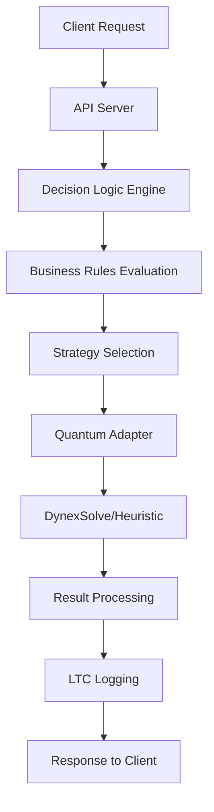

# 🚀 NQBA Developer Onboarding Guide
## Setup for FLYFOX AI, Goliath of All Trade, Sigma Select

Welcome to the **Neuromorphic Quantum Business Architecture (NQBA)** development team! This guide will get you from zero to productive in 15 minutes.

## 🎯 What You're Building

**NQBA** is the quantum-native execution layer that powers:
- **FLYFOX AI**: Quantum AI Digital Agents & Platform
- **Goliath of All Trade**: Quantum-Enhanced Financial Trading
- **Sigma Select**: AI Business Intelligence & Sales Optimization

**Architecture Flow**: High Council → **Q-Cortex** → **NQBA Core** → Agent Mesh → SaaS

---

## 🛠️ 1. Environment Setup

### Prerequisites
- **Python 3.12.3+** (required for quantum optimizations)
- **Git 2.40+** (for LTC commit tracking)
- **8GB+ RAM** (for quantum simulations)

### Quick Start (15 minutes)
```bash
# Clone the NQBA-Core repository
git clone https://github.com/flyfoxai/nqba-core.git
cd nqba-core

# Create virtual environment
python -m venv venv
# Windows:
venv\Scripts\activate
# macOS/Linux:
source venv/bin/activate

# Install core dependencies
pip install -r requirements.txt

# Install development tools
pip install ruff black mypy pytest pytest-asyncio pytest-cov

# Install pre-commit hooks for code quality
pre-commit install
```

### Verify Installation
```bash
# Check NQBA components
python -c "from nqba import QuantumAdapter, DecisionLogicEngine, LTCLogger; print('✅ NQBA Core loaded successfully')"

# Run basic tests
pytest tests/test_nqba_core.py -v

# Start the API server
uvicorn nqba.api_server:app --reload --port 8080
```

**🎉 Success!** Open http://localhost:8080/docs to see the Swagger UI.

---

## 🔐 2. Secrets & Configuration Setup

### GitHub Secrets (Required for CI/CD)
Navigate to `Settings > Secrets and variables > Actions` and add:

| Secret | Description | Example |
|--------|-------------|---------|
| `DYNEX_API_KEY` | DynexSolve API key for quantum optimizations | `dnx_...` |
| `WEB3_PROVIDER_URL` | Blockchain testnet URL | `https://testnet.dynexcoin.org` |
| `IPFS_PROJECT_ID` | IPFS credentials for decentralized storage | `Qm...` |
| `IPFS_PROJECT_SECRET` | IPFS project secret | `...` |
| `LLM_API_KEY` | qdLLM fallback (OpenAI, Grok, etc.) | `sk-...` |

### Local Environment (.env)
Create `.env` in your project root:
```bash
# Quantum Computing
DYNEX_API_KEY=your_dynex_api_key_here
NQBA_QUANTUM_PREFER=1  # 1=quantum first, 0=heuristic fallback

# Blockchain & Web3
WEB3_PROVIDER_URL=https://testnet.dynexcoin.org
DNX_WALLET_ADDRESS=your_dnx_wallet_address

# IPFS Storage
IPFS_PROJECT_ID=your_ipfs_project_id
IPFS_PROJECT_SECRET=your_ipfs_project_secret

# AI/LLM Fallback
LLM_API_KEY=your_openai_or_grok_api_key
LLM_MODEL=gpt-4  # or grok-beta

# NQBA Configuration
NQBA_LOG_LEVEL=INFO
NQBA_LTC_ENABLED=true
NQBA_QUANTUM_TIMEOUT_MS=500
```

### Load Environment
```bash
# Install python-dotenv if not already installed
pip install python-dotenv

# Load environment variables
export $(cat .env | xargs)  # Linux/macOS
# Windows PowerShell:
Get-Content .env | ForEach-Object { if($_ -match '^([^#][^=]+)=(.*)$') { [Environment]::SetEnvironmentVariable($matches[1], $matches[2]) } }
```

---

## 🧪 3. Testing & Quality Assurance

### Run Test Suite
```bash
# Quick test run
pytest -q

# Comprehensive testing with coverage
pytest --cov=src --cov-report=html --cov-report=term-missing

# Run specific test categories
pytest tests/test_nqba_core.py::test_quantum_adapter -v
pytest tests/test_nqba_core.py::test_decision_logic -v
pytest tests/test_nqba_core.py::test_ltc_logger -v

# Performance testing
pytest tests/test_performance.py -v --benchmark-only
```

### Code Quality Gates
```bash
# Format code with Black
black src/ tests/

# Lint with Ruff
ruff check src/ tests/
ruff check src/ tests/ --fix

# Type checking with MyPy
mypy src/ --ignore-missing-imports

# Security scanning
bandit -r src/
```

**🎯 Target**: 90%+ test coverage, 0 linting errors, all type checks pass

---

## 🚀 4. API Development & Testing

### Start Development Server
```bash
# Development mode with auto-reload
uvicorn nqba.api_server:app --reload --port 8080 --host 0.0.0.0

# Production mode
uvicorn nqba.api_server:app --host 0.0.0.0 --port 8080 --workers 4
```

### API Endpoints Overview
| Endpoint | Method | Purpose | Example |
|----------|--------|---------|---------|
| `/healthz` | GET | Health check | `curl http://localhost:8080/healthz` |
| `/v1/decide` | POST | Business decision making | See examples below |
| `/v1/optimize` | POST | Quantum optimization | See examples below |
| `/v1/ltc/search` | GET | Search LTC entries | `?query=lead_scoring&date=2024-01-15` |
| `/v1/ltc/entries` | GET | List LTC entries | `?limit=10&offset=0` |

### Test API Endpoints
```bash
# Health check
curl http://localhost:8080/healthz

# Lead scoring decision
curl -X POST http://localhost:8080/v1/decide \
  -H "Content-Type: application/json" \
  -d '{
    "context": {
      "decision_type": "lead_scoring",
      "business_unit": "sigma_select",
      "data": {
        "lead_score": 85,
        "company_size": "enterprise",
        "budget_range": "100k-500k"
      }
    }
  }'

# Route optimization
curl -X POST http://localhost:8080/v1/optimize \
  -H "Content-Type: application/json" \
  -d '{
    "objective": "route_optimization",
    "constraints": {
      "fleet_size": 25,
      "time_windows": true,
      "max_distance": 500
    },
    "preferences": {
      "quantum_first": true,
      "timeout_ms": 1000
    }
  }'
```

---

## 🔧 5. Your First Contribution

### Branch Strategy
```bash
# Create feature branch
git checkout -b feature/your-feature-name

# Example: Adding lead scoring enhancement
git checkout -b feature/enhance-lead-scoring
```

### Development Workflow
1. **Code**: Implement your feature in the appropriate module
2. **Test**: Add tests to `tests/` directory
3. **Quality**: Run code quality checks
4. **Commit**: Use conventional commit format
5. **Push**: Create pull request

### Example: Adding a New Business Rule
```python
# In src/nqba/decision_logic.py
from enum import Enum
from dataclasses import dataclass

class BusinessRuleType(Enum):
    LEAD_SCORING = "lead_scoring"
    RISK_ASSESSMENT = "risk_assessment"
    PORTFOLIO_ALLOCATION = "portfolio_allocation"

@dataclass
class BusinessRule:
    rule_id: str
    rule_type: BusinessRuleType
    conditions: dict
    actions: dict
    priority: int = 1

# Add your rule
def _load_default_rules(self) -> List[BusinessRule]:
    rules = [
        # ... existing rules ...
        BusinessRule(
            rule_id="enterprise_lead_boost",
            rule_type=BusinessRuleType.LEAD_SCORING,
            conditions={
                "company_size": "enterprise",
                "min_budget": 100000
            },
            actions={
                "score_boost": 15,
                "priority": "high"
            },
            priority=2
        )
    ]
    return rules
```

### Testing Your Changes
```bash
# Run specific test for your feature
pytest tests/test_nqba_core.py::test_decision_logic -v -k "enterprise_lead_boost"

# Run all tests to ensure no regressions
pytest --cov=src --cov-report=html

# Check code quality
black src/ tests/
ruff check src/ tests/
mypy src/
```

### Commit & Push
```bash
# Stage your changes
git add src/nqba/decision_logic.py tests/test_nqba_core.py

# Commit with conventional format
git commit -m "feat: add enterprise lead scoring rule [T1]

- Add enterprise_lead_boost business rule
- Implement company size and budget conditions
- Add corresponding test coverage
- Update LTC logging for rule evaluation"

# Push to your feature branch
git push origin feature/enhance-lead-scoring
```

---

## 📚 6. NQBA Architecture Deep Dive

### Core Components

#### 1. **QuantumAdapter** (`src/nqba/quantum_adapter.py`)
- **Purpose**: Unified interface for quantum computing backends
- **Supported**: DynexSolve, Qiskit, Cirq, PennyLane
- **Fallback**: Heuristic algorithms when quantum is unavailable
- **Key Methods**:
  - `optimize_qubo()`: Quadratic Unconstrained Binary Optimization
  - `execute_circuit()`: Quantum circuit execution
  - `get_backend_status()`: Backend availability check

#### 2. **DecisionLogicEngine** (`src/nqba/decision_logic.py`)
- **Purpose**: Business rule processing and optimization strategy selection
- **Features**: Context-aware decision routing, SigmaEQ-style rules
- **Key Methods**:
  - `make_decision()`: Process business decisions
  - `evaluate_rules()`: Apply business rules
  - `select_optimization_strategy()`: Choose quantum vs heuristic

#### 3. **LTCLogger** (`src/nqba/ltc_logger.py`)
- **Purpose**: Living Technical Codex - comprehensive operation logging
- **Features**: Hash chaining, thread references, JSONL format
- **Key Methods**:
  - `log_operation()`: Log any NQBA operation
  - `search_entries()`: Search LTC for specific operations
  - `get_thread_reference()`: Generate unique thread IDs

#### 4. **APIServer** (`src/nqba/api_server.py`)
- **Purpose**: FastAPI-based REST API exposing NQBA capabilities
- **Features**: OpenAPI docs, request validation, error handling
- **Endpoints**: Decision making, optimization, LTC search

### Data Flow Example


---

## 🎯 7. Business Use Cases

### Sigma Select: Lead Scoring
```python
# Example: Lead scoring optimization
from nqba import DecisionLogicEngine, QuantumAdapter

# Initialize components
decision_engine = DecisionLogicEngine()
quantum_adapter = QuantumAdapter()

# Lead scoring context
context = DecisionContext(
    decision_type=DecisionType.LEAD_SCORING,
    business_unit="sigma_select",
    data={
        "leads": [
            {"id": 1, "score": 75, "company_size": "mid_market", "budget": 50000},
            {"id": 2, "score": 85, "company_size": "enterprise", "budget": 200000},
            {"id": 3, "score": 65, "company_size": "startup", "budget": 25000}
        ]
    }
)

# Make decision
result = decision_engine.make_decision(context)
print(f"Recommended action: {result.recommended_action}")
```

### Goliath Trading: Portfolio Optimization
```python
# Example: Portfolio allocation optimization
context = DecisionContext(
    decision_type=DecisionType.PORTFOLIO_OPTIMIZATION,
    business_unit="goliath_trading",
    data={
        "assets": ["BTC", "ETH", "DNX", "AAPL", "GOOGL"],
        "risk_tolerance": "moderate",
        "target_return": 0.15,
        "constraints": {"max_volatility": 0.25}
    }
)

# Optimize portfolio
result = decision_engine.make_decision(context)
print(f"Optimal allocation: {result.optimization_result}")
```

---

## 🔍 8. Debugging & Troubleshooting

### Common Issues & Solutions

#### Issue: Quantum Backend Unavailable
```bash
# Check backend status
curl http://localhost:8080/v1/healthz

# Verify Dynex API key
echo $DYNEX_API_KEY

# Check quantum adapter logs
tail -f logs/nqba.log | grep "quantum_adapter"
```

#### Issue: LTC Logging Failures
```bash
# Check LTC directory permissions
ls -la ltc/

# Verify LTC configuration
python -c "from nqba.ltc_logger import LTCLogger; ltc = LTCLogger(); print(ltc.config)"

# Test LTC writing
python -c "from nqba.ltc_logger import LTCLogger; ltc = LTCLogger(); ltc.log_operation('test', {'message': 'LTC test'})"
```

#### Issue: Decision Logic Errors
```bash
# Enable debug logging
export NQBA_LOG_LEVEL=DEBUG

# Test decision logic directly
python -c "
from nqba.decision_logic import DecisionLogicEngine
engine = DecisionLogicEngine()
print('Rules loaded:', len(engine.business_rules))
print('Strategies:', [s.value for s in engine.optimization_strategies])
"
```

### Performance Monitoring
```bash
# Monitor API performance
curl -w "@curl-format.txt" -o /dev/null -s "http://localhost:8080/v1/healthz"

# Check quantum execution times
grep "quantum_execution_time" ltc/events.jsonl | tail -5

# Monitor memory usage
python -c "
import psutil
process = psutil.Process()
print(f'Memory: {process.memory_info().rss / 1024 / 1024:.1f} MB')
"
```

---

## 🚀 9. Advanced Development

### Custom Quantum Backends
```python
# In src/nqba/quantum_adapter.py
class CustomQuantumBackend(QuantumBackend):
    def __init__(self, config: dict):
        self.config = config
        self.name = "custom_backend"
    
    def is_available(self) -> bool:
        # Implement availability check
        return True
    
    def optimize_qubo(self, qubo_matrix: np.ndarray, **kwargs) -> OptimizationResult:
        # Implement your quantum optimization
        # This could be a custom quantum algorithm
        pass

# Register your backend
quantum_adapter = QuantumAdapter()
quantum_adapter.register_backend(CustomQuantumBackend({"custom_param": "value"}))
```

### Custom Business Rules Engine
```python
# Extend the decision logic engine
class CustomDecisionEngine(DecisionLogicEngine):
    def __init__(self):
        super().__init__()
        self.custom_rules = self._load_custom_rules()
    
    def _load_custom_rules(self) -> List[BusinessRule]:
        # Load your custom business rules
        return [
            BusinessRule(
                rule_id="custom_rule",
                rule_type=BusinessRuleType.CUSTOM,
                conditions={"custom_condition": True},
                actions={"custom_action": "value"}
            )
        ]
    
    def evaluate_custom_rules(self, context: DecisionContext) -> List[RuleEvaluation]:
        # Implement custom rule evaluation logic
        pass
```

### LTC Custom Schemas
```python
# Define custom LTC entry schemas
from nqba.ltc_logger import LTCLogger
from dataclasses import dataclass
from typing import Any, Dict

@dataclass
class CustomLTCEntry:
    operation_type: str
    custom_data: Dict[str, Any]
    metadata: Dict[str, Any]

# Log custom entries
ltc = LTCLogger()
custom_entry = CustomLTCEntry(
    operation_type="custom_operation",
    custom_data={"key": "value"},
    metadata={"source": "custom_module"}
)

ltc.log_operation("custom_operation", custom_entry.__dict__)
```

---

## 📊 10. Monitoring & Observability

### Health Checks
```bash
# Comprehensive health check
curl http://localhost:8080/healthz | jq '.'

# Component-specific health
curl http://localhost:8080/healthz/quantum
curl http://localhost:8080/healthz/decision_logic
curl http://localhost:8080/healthz/ltc
```

### Metrics & Logs
```bash
# View LTC entries
curl http://localhost:8080/v1/ltc/entries?limit=10 | jq '.'

# Search specific operations
curl "http://localhost:8080/v1/ltc/search?query=lead_scoring&date=2024-01-15" | jq '.'

# Monitor logs in real-time
tail -f logs/nqba.log | grep -E "(ERROR|WARNING|INFO)"
```

### Performance Dashboard
```bash
# Start Streamlit dashboard (if available)
streamlit run dashboard.py

# Or use the API metrics
curl http://localhost:8080/metrics
```

---

## 🤝 11. Collaboration & Code Review

### Pull Request Process
1. **Create Feature Branch**: `feature/your-feature-name`
2. **Implement & Test**: Follow coding standards, add tests
3. **Quality Gates**: All checks must pass
4. **Create PR**: Use the provided template
5. **Review**: Tag appropriate reviewers
6. **Merge**: After approval and CI passes

### Code Review Checklist
- [ ] **Functionality**: Does the code do what it's supposed to?
- [ ] **Testing**: Are there adequate tests?
- [ ] **Documentation**: Is the code self-documenting?
- [ ] **Performance**: Are there any performance concerns?
- **Security**: Are there any security vulnerabilities?
- [ ] **LTC Integration**: Is the operation properly logged?

### Communication Channels
- **GitHub Issues**: For bugs, features, and discussions
- **Pull Requests**: For code reviews and collaboration
- **Discussions**: For architectural decisions and planning
- **LTC**: For technical decisions and their rationale

---

## 🎓 12. Learning Resources

### NQBA Concepts
- **Neuromorphic Computing**: Brain-inspired computing architectures
- **Quantum Computing**: Qubits, superposition, entanglement
- **Business Architecture**: How technology serves business objectives
- **Living Technical Codex**: Immutable, traceable decision logging

### Recommended Reading
- **Quantum Computing**: "Quantum Computing for Everyone" by Chris Bernhardt
- **Neuromorphic**: "Neuromorphic Engineering" by Kwabena Boahen
- **Business Architecture**: "The Business Architecture Quick Guide" by Whynde Kuehn
- **API Design**: "Designing Web APIs" by Brenda Jin

### Training & Certification
- **Quantum**: IBM Quantum Experience, Qiskit tutorials
- **Neuromorphic**: Intel Loihi tutorials, BrainChip documentation
- **API Development**: FastAPI documentation, OpenAPI specification
- **Testing**: pytest documentation, Test-Driven Development

---

## 🚀 13. Next Steps

### Immediate Actions (Week 1)
1. **Complete Setup**: Follow this guide step-by-step
2. **Run Demos**: Execute the provided demo scripts
3. **Explore Code**: Understand the NQBA architecture
4. **First Contribution**: Make a small enhancement

### Short-term Goals (Month 1)
1. **Master NQBA Core**: Understand all components
2. **Contribute Features**: Add business rules or optimizations
3. **Improve Tests**: Increase test coverage
4. **Documentation**: Update or enhance existing docs

### Long-term Vision (Quarter 1)
1. **Own Components**: Become expert in specific areas
2. **Mentor Others**: Help onboard new team members
3. **Architecture Input**: Contribute to design decisions
4. **Business Impact**: Drive NQBA adoption in business units

---

## 📞 Support & Contact

### Getting Help
- **Documentation**: Check `docs/` directory first
- **Issues**: Create GitHub issues for bugs or questions
- **Discussions**: Use GitHub Discussions for general questions
- **Code Review**: Ask questions in pull request comments

### Team Contacts
- **Technical Lead**: @GoliathBritton
- **Architecture**: @FLYFOX-AI-Architects
- **Business Logic**: @SigmaEQ-Team
- **Quantum Integration**: @Dynex-Integration

### Office Hours
- **Weekly Standup**: Every Monday 9:00 AM EST
- **Architecture Review**: Every Wednesday 2:00 PM EST
- **Code Review**: Every Friday 10:00 AM EST

---

## 🎉 Welcome to the Team!

You're now part of building the future of **Neuromorphic Quantum Business Architecture**. 

**Remember**: Every line of code you write contributes to the quantum revolution in business intelligence. The LTC will remember your contributions forever.

**Ready to make your first quantum decision?** 🚀

---

*Last updated: January 2025*  
*Version: 2.0*  
*Maintainer: FLYFOX AI Development Team*
